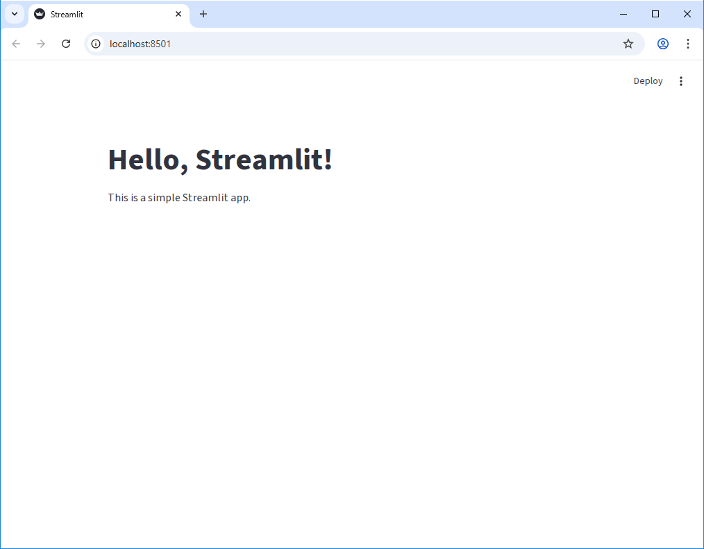
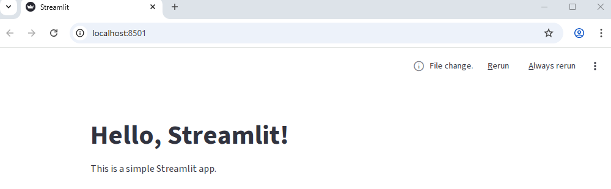
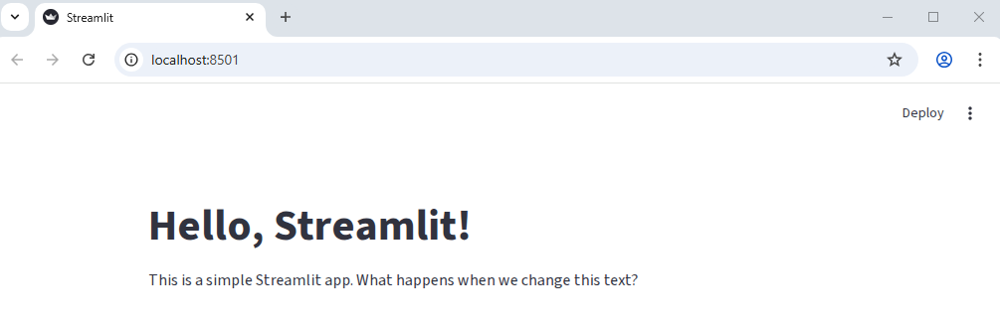
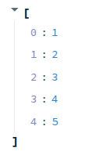
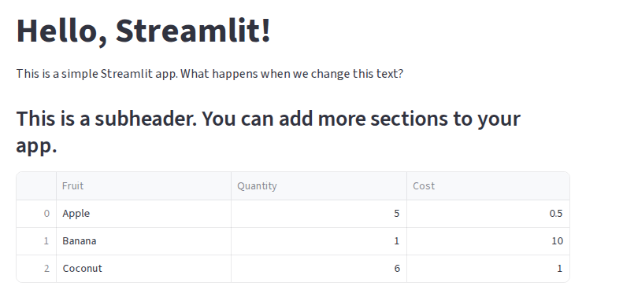
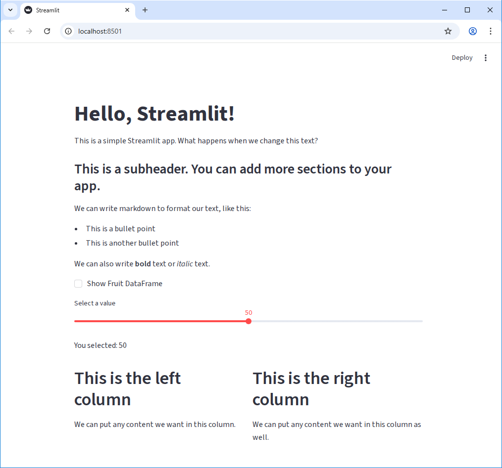

:::::::::::::::::::::::::::::::::::::: questions

- How do we create our own Streamlit app?
- How can I add text, data, and widgets to my Streamlit app?
- How can I adjust the appearance and layout of my Streamlit app?

::::::::::::::::::::::::::::::::::::::::::::::::

::::::::::::::::::::::::::::::::::::: objectives

- Create a basic Streamlit app and run it in the browser
- Use `st.write` and `st.markdown` to add text and formatted text to our app
- Add simple widgets to our app and understand how they work
- Add a multi-column layout to our app

::::::::::::::::::::::::::::::::::::::::::::::::

## Running a Streamlit App

We have our environment set up with streamlit installed, so let's run a simple Streamlit app to see
what it can look like. Streamlit comes with a built-in demo app that we can run to see some of the
features of Streamlit in action. To run the demo, open your terminal and run the following command:

```bash
uv run streamlit hello
```

You should see something like the following output in your terminal:

```
  Welcome to Streamlit. Check out our demo in your browser.

  Local URL: http://localhost:8501
  Network URL: http://137.226.104.51:8501

  Ready to create your own Python apps super quickly?
  Head over to https://docs.streamlit.io

  May you create awesome apps!
```

A new tab should open in your browser with the Streamlit demo app running. You can interact with
this just like it was a normal web app - however if you look a the url in the address bar, you'll
notice that it's running on `localhost:8501`. This means that the app is actually running on your
local machine, and Streamlit is serving it to your browser.

Feel free to click around for a minute and explore the demo app.

When you're ready, you can stop the app by going back to your terminal and pressing `Ctrl + C`.

## Starting our own Streamlit App

Now that we've seen the demo app, let's create our own. To start with, let's empty out the
`main.py` file that `uv init` created for us. Open `main.py` in your code editor and delete all the
existing code, then replace it with the following:

```python
import streamlit as st

st.title("Hello, Streamlit!")
st.write("This is a simple Streamlit app.")
```

To run this app, we just need to modify our previous command a little bit. Instead of running
`uv run streamlit hello`, we can run:

```bash
uv run streamlit run main.py
```

You should see the same output in your terminal, but now your browser should open a new tab that
looks like this:

{alt="Streamlit Hello World App"}

## Editing the App

Let's make a small change to our app to see how Streamlit handles updates. Open `main.py` in your
code editor and change the `st.write` line to the following:

```python
st.write("This is a simple Streamlit app. What happens when we change this text?")
```

Back on our browser tab, you may see that nothing appears to have changed. However if you look
closely at the upper right corner of the page, you should see that the "Deploy" link has been
replaced with three new elements: the text "File change" and two clickable links "Rerun" and
"Always rerun".

{alt="Streamlit File Change Detected"}

Let's click the "Always rerun" link and see what happens.

{alt="Streamlit File Change Detected After Rerun"}

As you can see, the app has updated with our new text! Let's make another change. Let's add another
line to out app that creates a subheading:

```python
st.subheader("This is a subheader. You can add more sections to your app.")
```

Switching back to our browser, we should see the changes implmented immediately without us having
to refresh the page or click any buttons! This is one of the features of streamlit - as long as we
don't cancel the application running in the terminal, it will automatically detect changes to our
code and update the app in real time.

## Writing Markdown

We can also write plain markdown for our streamlit app, which allows us to easily format large
blocks of text. To write markdown, we can use the `st.markdown` function. Let's update our app
to include some markdown:

```python
import streamlit as st
import pandas as pd

st.title("Hello, Streamlit!")

st.write("This is a simple Streamlit app. What happens when we change this text?")
st.subheader("This is a subheader. You can add more sections to your app.")

st.markdown(
    """
    We can write markdown to format our text, like this:

    - This is a bullet point
    - This is another bullet point

    We can also write **bold** text or *italic* text.
    """
)
```

## Displaying Data

We can do more than just display text though, of course. Let's pass a list of numbers to the
`st.write` function and see what happens:

```python
st.write([1, 2, 3, 4, 5])
```

When we save this change and switch back to our browser, we should see that the list of numbers is
now a collapsable list in our app. We can click the little arrow next to the list to expand or
collapse it.

{alt="Streamlit List Display"}

Let's try passing a different data object to `st.write`. Let's make a simple pandas DataFrame and
pass that to `st.write`:

```python
import streamlit as st
import pandas as pd

st.title("Hello, Streamlit!")
st.write("This is a simple Streamlit app. What happens when we change this text?")
st.subheader("This is a subheader. You can add more sections to your app.")

st.markdown(
    """
    We can write markdown to format our text, like this:

    - This is a bullet point
    - This is another bullet point

    We can also write **bold** text or *italic* text.
    """
)

my_dataframe = pd.DataFrame(
    {"Fruit": ["Apple", "Banana", "Coconut"], "Quantity": [5, 1, 6], "Cost": [0.5, 10.00, 1.0]}
)
st.write(my_dataframe)
```

When we save this change and switch back to our browser, we should see that the DataFrame is now
displayed as a table in our app:

{alt="Streamlit DataFrame Display"}

But that's not all - the table already has some built-in interactivity! We can click the column
headers to sort the table, or, by hovering over the table, get a tooltip that allows us to download
the table as a CSV, search the table, or make the table fullscreen.

::: callout

### st.write

The `st.write` function can be thought of similar to the built-in `print` function in Python, but
for Streamlit apps. It can take in a wide variety of data types and will intelligently display
them in the app.

:::

## Widgets

We can add a variety of interactive widgets to our app. Try the following:

```python
import streamlit as st
import pandas as pd

st.title("Hello, Streamlit!")
st.write("This is a simple Streamlit app. What happens when we change this text?")
st.subheader("This is a subheader. You can add more sections to your app.")

st.markdown(
    """
    We can write markdown to format our text, like this:

    - This is a bullet point
    - This is another bullet point

    We can also write **bold** text or *italic* text.
    """
)

if st.checkbox("Show Fruit DataFrame"):
    my_dataframe = pd.DataFrame(
        {"Fruit": ["Apple", "Banana", "Coconut"], "Quantity": [5, 1, 6], "Cost": [0.5, 10.00, 1.0]}
    )
    st.write(my_dataframe)

my_value = st.slider("Select a value", 0, 100, 50)
st.write(f"You selected: {my_value}")
```

## Layout

Finally, we can control the layout of our app using the built-in layout functions. Let's use the
`st.columns` function to create a two-column layout:

```python
import streamlit as st
import pandas as pd

st.title("Hello, Streamlit!")
st.write("This is a simple Streamlit app. What happens when we change this text?")
st.subheader("This is a subheader. You can add more sections to your app.")

st.markdown(
    """
    We can write markdown to format our text, like this:

    - This is a bullet point
    - This is another bullet point

    We can also write **bold** text or *italic* text.
    """
)

if st.checkbox("Show Fruit DataFrame"):
    my_dataframe = pd.DataFrame(
        {"Fruit": ["Apple", "Banana", "Coconut"], "Quantity": [5, 1, 6], "Cost": [0.5, 10.00, 1.0]}
    )
    st.write(my_dataframe)

my_value = st.slider("Select a value", 0, 100, 50)
st.write(f"You selected: {my_value}")

left_column, right_column = st.columns(2)
with left_column:
    st.header("This is the left column")
    st.write("We can put any content we want in this column.")
with right_column:
    st.header("This is the right column")
    st.write("We can put any content we want in this column as well.")
```

Our app at this point should look something like this:

{alt="Streamlit Widgets and Layout"}

::::::::::::::::::::::::::::::::::::: challenge

## Challenge 1: Add a Text Input Widget

We've seen a few widgets so far. Add a text input widget to your app that allows the user to enter
their name, and then display a personalized greeting.

The function for creating a text input widget is `st.text_input`.

::: hint

Use the slider example as a reference.

:::

:::::::::::::::::::::::: solution

```python
name = st.text_input("Enter your name")
if name:
    st.write(f"Hello, {name}!")
```

:::::::::::::::::::::::::::::::::

::::::::::::::::::::::::::::::::::::::::::::::::

::::::::::::::::::::::::::::::::::::: challenge

## Challenge 2: Add another column

Use the `st.columns` function to create a three-column layout instead of a two-column layout. In
the new column, add a widget of your choice and some text.

:::::::::::::::::::::::: solution

```python
left_column, center_column, right_column = st.columns(3)
with left_column:
    st.header("This is the left column")
    st.write("We can put any content we want in this column.")
with center_column:
    st.header("This is the center column")
    st.text_input("Enter some text")
with right_column:
    st.header("This is the right column")
    st.write("We can put any content we want in this column as well.")
```

:::::::::::::::::::::::::::::::::

::::::::::::::::::::::::::::::::::::::::::::::::

::::::::::::::::::::::::::::::::::::: challenge

## Challenge 3: st.metric

Play around with the `st.metric` widget. What does it do? Try adding the parameter `delta` to it
and see what happens.

Bonus: Instead of a static value, use the  `st.slider` widget to create a metric that updates
the delta based on the slider value.

:::::::::::::::::::::::: solution

```python
my_number = st.slider("Pick a number", -10, 10, 5)
st.metric("My Metric", 10, delta=my_number)
```

:::::::::::::::::::::::::::::::::

::::::::::::::::::::::::::::::::::::::::::::::::

::::::::::::::::::::::::::::::::::::: keypoints

- We can run a Streamlit app with `uv run streamlit run {script-name}.py`.
- Streamlit automatically detects changes to our code and updates the app in real time.
- We can write text to our app using `st.write` and `st.markdown`.
- `st.write` can take in a wide variety of data types and will intelligently display them.
- Streamlit has a variety of built-in widgets that we can use to add interactivity to our app.

::::::::::::::::::::::::::::::::::::::::::::::::
