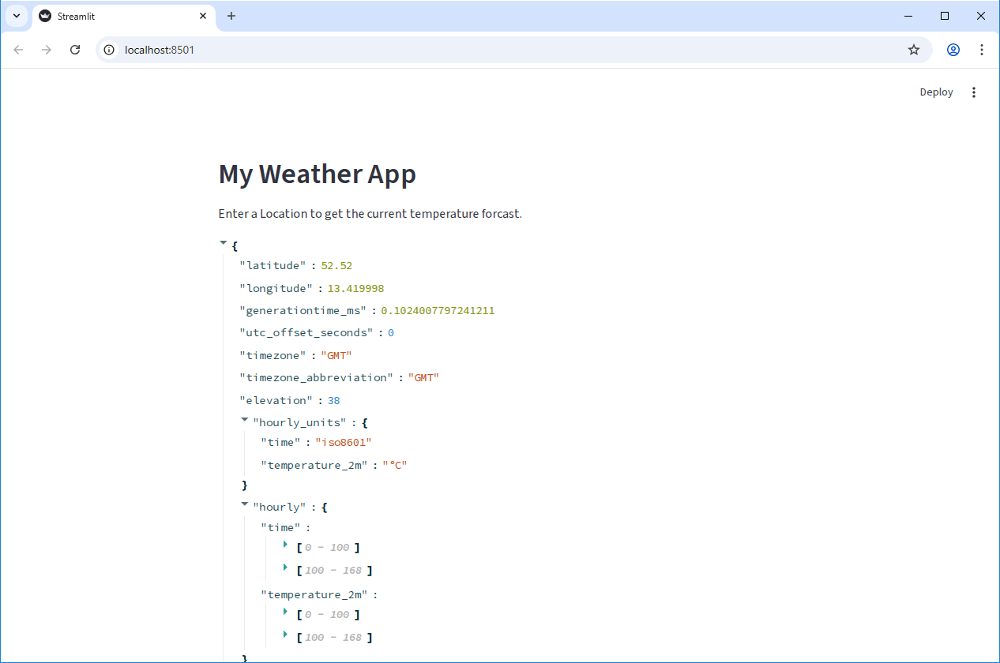
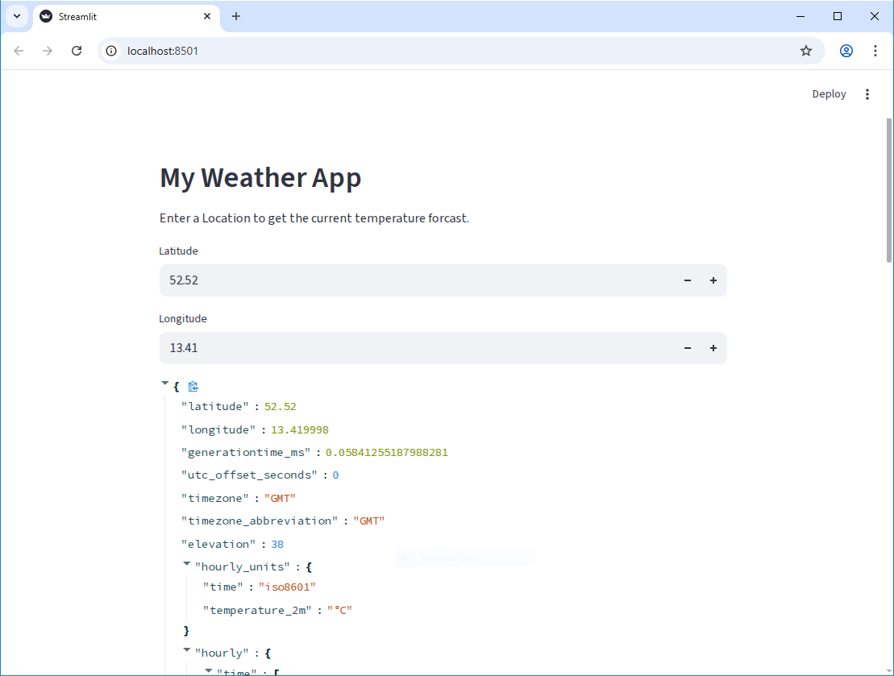
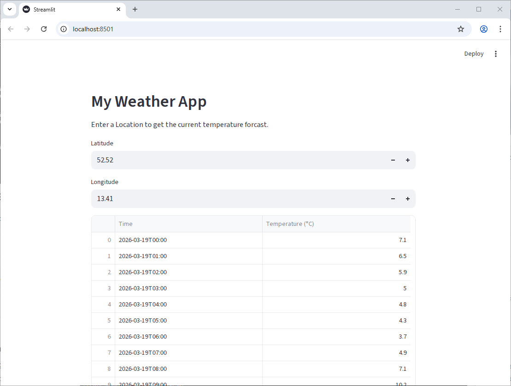
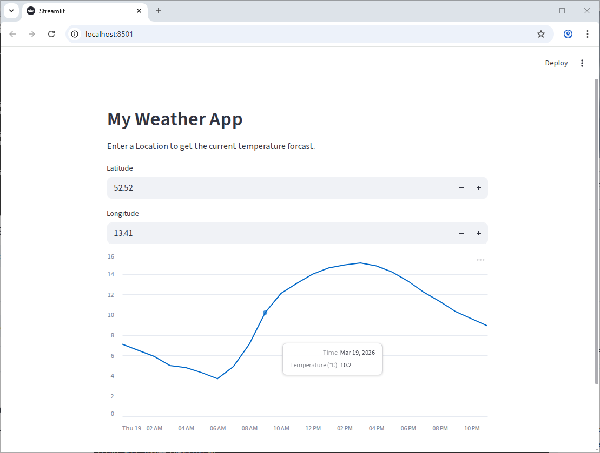
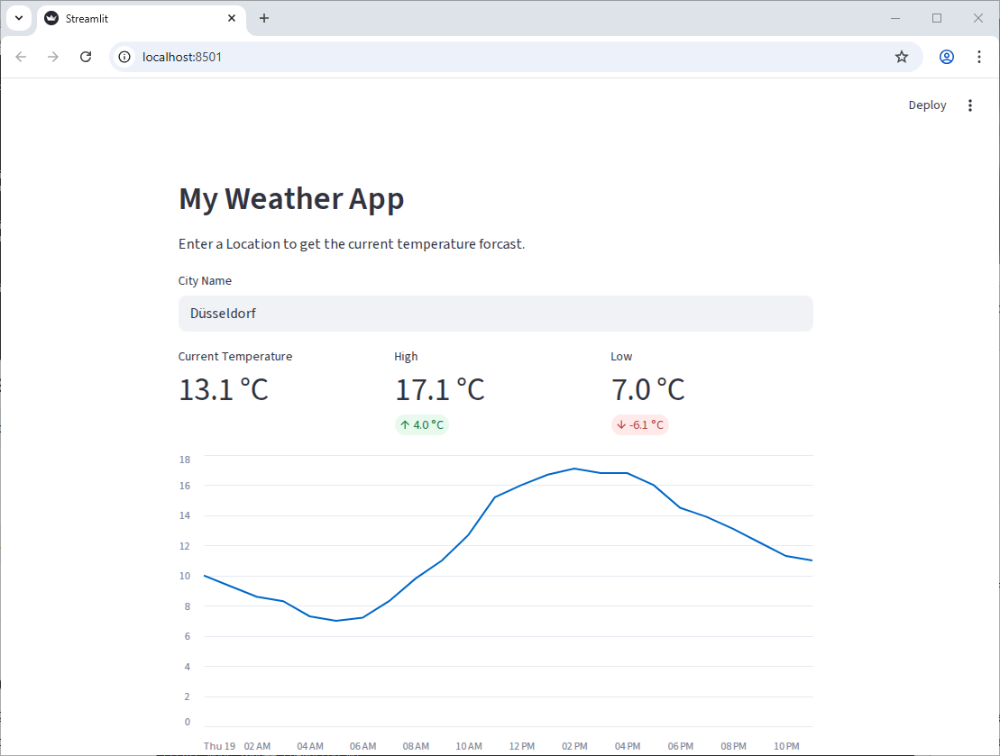

:::::::::::::::::::::::::::::::::::::: questions

- How can we incorporate live data into our application?
- What is an API and how can we use it to get data from a web service?
- How can we use Streamlit widgets to get user input and use that input to make API requests?
- How can we display data from an API?

::::::::::::::::::::::::::::::::::::::::::::::::

::::::::::::::::::::::::::::::::::::: objectives

- Create a Streamlit app that makes requests to a web API and displays the data
- Use Streamlit widgets to get user input and use that input to make API requests
- Display data from an API in a Streamlit app using both `st.write` and charts

::::::::::::::::::::::::::::::::::::::::::::::::

## What is an API?

API stands for "Application Programming Interface". An API is a set of rules and protocols that
allows software to comunicate with each other. For our purposes here, an API is a way for us to
get data from a web service. The data is typically (but not always!) return in JSON format, which
allows us to easily work with it in Python.

## Getting Data from an API

Let's start fresh with a new file. Use Ctrl-C to close our basic streamlit app, then let's create
a new file called `weather_app.py` and open it in your code editor. We can start by just adding
some simple text to our app to make sure it's working:

```python
import streamlit as st

st.header("My Weather App")
st.write("Enter a Location to get the current temperature forcast.")

```

We're going to use an open API from Open-Meteo to get weather data. Because it's open, we won't
need an API key or credentials to access it. In essence, an API is just an address on the internet
that will return data. Looking at the [Open-Meteo API documentation](https://open-meteo.com/en/docs),
we can see that we can get the weather forcast for a specific location by sending request like
this:

```
https://api.open-meteo.com/v1/forecast?latitude=52.52&longitude=13.41&hourly=temperature_2m
```

Putting that URL into our browser will return a JSON object:

```json
{
  "latitude": 52.52,
  "longitude": 13.419998,
  "generationtime_ms": 0.0736713409423828,
  "utc_offset_seconds": 0,
  "timezone": "GMT",
  "timezone_abbreviation": "GMT",
  "elevation": 38,
  "hourly_units": {
    "time": "iso8601",
    "temperature_2m": "°C"
  },
  "hourly": {
    "time": [
      "2026-03-18T00:00",
      "2026-03-18T01:00",
      "2026-03-18T02:00",
      "2026-03-18T03:00",
...
```

Looking at the URL, there's a question mark (`?`) followed by a series of key-value pairs
separated by ampersands (`&`). This is called the "query string" and it's used to specify the
parameters for our API request. Let's add this query to our Streamlit app and see how it returns
the data. We need another library for this - `requests`. This is a popular library for making HTTP
requests in python.

::: prerequisite

In our first episode, we set up uv and added the `requests` package to our project. If you haven't
done that yet, run the command `uv add requests` in your terminal to add it to your project.

:::

```python
import requests
import streamlit as st

st.header("My Weather App")
st.write("Enter a Location to get the current temperature forcast.")

url = "https://api.open-meteo.com/v1/forecast?latitude=52.52&longitude=13.41&hourly=temperature_2m&forecast_days=1"
response = requests.get(url)
data = response.json()
st.write(data)
```

When you run this code, you should see the JSON data from the API displayed in your Streamlit app.

{alt="Raw JSON data from the Open-Meteo API displayed in a Streamlit app."}

::: callout

When using APIs, it's good practice to check the API documentation to see if there are any
restrictions on how many requests you can make in a certain time period (called "rate limits"), or
if there are any specific parameters you need to include in your request. It's important to be a
good API consumer and follow any guidelines set by the API provider.

If we were requesting lots of data, or making the same request multiple times, we might want to add
caching to our app to avoid hitting rate limits or to improve performance. But for this simple app,
we'll just make the request directly without caching.

:::

## Using a widget to get user input

In the previous episode we saw how to use Streamlit widgets to get user input. Let's add a pair of
widgets to let the user specify the latitude and longitude for the location they want to get the
weather forcast for. We can use `st.number_input` to get numeric input from the user:

```python
import requests
import streamlit as st

st.header("My Weather App")
st.write("Enter a Location to get the current temperature forcast.")

latitude = st.number_input("Latitude", key="latitude", value=52.52)
longitude = st.number_input("Longitude", key="longitude", value=13.41)

url = f"https://api.open-meteo.com/v1/forecast?latitude={latitude}&longitude={longitude}&hourly=temperature_2m&forecast_days=1"
response = requests.get(url)
data = response.json()
st.write(data)
```

Now, as you change the values in the number inputs, you can see the API data update in real time to
show the weather forcast for the new location.

{alt="Raw JSON data from the Open-Meteo API displayed in a Streamlit app, with number input widgets for latitude and longitude."}

## Displaying a chart with the API data

Of course, we want to do something more interesting than just displaying a list of numbers. Let's co
convert the data into a Pandas DataFrame:

```python
import pandas as pd
import requests
import streamlit as st

st.header("My Weather App")
st.write("Enter a Location to get the current temperature forcast.")

latitude = st.number_input("Latitude", key="latitude", value=52.52)
longitude = st.number_input("Longitude", key="longitude", value=13.41)

url = f"https://api.open-meteo.com/v1/forecast?latitude={latitude}&longitude={longitude}&hourly=temperature_2m&forecast_days=1"
response = requests.get(url)
data = response.json()
df = pd.DataFrame(data["hourly"]).rename(columns={"time": "Time", "temperature_2m": "Temperature (°C)"})
st.write(df)
```

{alt="A Pandas DataFrame created from the API data, displayed in a Streamlit app."}

Getting there, but we can do better! Since we have data with a time component, it would be nice to
display it as a line chart. Much like the `st.write` function, Streamlit can do a fair bit of
guessing about how to display our data based on the data type. Let's tell it that the index of the
dataframe is `Time` and pass the dataframe to `st.line_chart`:

```python
import pandas as pd
import requests
import streamlit as st

st.header("My Weather App")
st.write("Enter a Location to get the current temperature forcast.")

latitude = st.number_input("Latitude", key="latitude", value=52.52)
longitude = st.number_input("Longitude", key="longitude", value=13.41)

url = f"https://api.open-meteo.com/v1/forecast?latitude={latitude}&longitude={longitude}&hourly=temperature_2m&forecast_days=1"
response = requests.get(url)
data = response.json()
df = pd.DataFrame(data["hourly"]).rename(columns={"time": "Time", "temperature_2m": "Temperature (°C)"})
df["Time"] = pd.to_datetime(df["Time"])
df.set_index("Time", inplace=True)

st.line_chart(df)
```
You should get something like this:

{alt="A line chart in Streamlit showing the hourly temperature forcast for a specific location."}

## Cleaning up our code

The API URL is hard to read and has a lot of string concatenation. We can use the `params` argument
of `requests.get` to make this cleaner.

```python
import pandas as pd
import requests
import streamlit as st

API_URL = "https://api.open-meteo.com/v1/"

st.header("My Weather App")
st.write("Enter a Location to get the current temperature forcast.")

latitude = st.number_input("Latitude", key="latitude", value=52.52)
longitude = st.number_input("Longitude", key="longitude", value=13.41)

params = {
    "latitude": latitude,
    "longitude": longitude,
    "hourly": "temperature_2m",
    "forecast_days": 1
}
response = requests.get(f"{API_URL}forecast", params=params)

data = response.json()
df = pd.DataFrame(data["hourly"]).rename(columns={"time": "Time", "temperature_2m": "Temperature (°C)"})
df["Time"] = pd.to_datetime(df["Time"])
df.set_index("Time", inplace=True)

st.line_chart(df)
```

::::::::::::::::::::::::::::::::::::: challenge

## Challenge 1: Fine-tuning Widgets

Our latitude and longitude inputs currently allow the user to enter in any number, which means we
can make requests to the API with invalid coordinates. Use the
[Streamlit Documentation for st.number_input](https://docs.streamlit.io/develop/api-reference/widgets/st.number_input)
to prevent the user for entering in invalid coordinates.

(Latitude should be between -90 and 90, and longitude should be between -180 and 180.)

::: hint

You can use the `min_value` and `max_value` parameters of `st.number_input`.

:::


:::::::::::::::::::::::: solution

```python
latitude = st.number_input("Latitude", key="latitude", value=52.52, min_value=-90.0, max_value=90.0)
longitude = st.number_input("Longitude", key="longitude", value=13.41, min_value=-180.0, max_value=180.0)
```

:::::::::::::::::::::::::::::::::

::::::::::::::::::::::::::::::::::::::::::::::::

::::::::::::::::::::::::::::::::::::: challenge

## Challenge 2: Geocoding

It's not very user-friendly to have to enter in the exact latitude and longitude for a location.
It would be much nicer if the user could just enter in a city name and have the app figure out the
latitude and longitude for that city. Looking at the Open-Meteo documentation, we can see that they
only let us provide data as coordinates, but there is another endpoint we can use to convert a city
name into coordinates: https://open-meteo.com/en/docs/geocoding-api

Replace the latitude and longitude number inputs with a single text input where the user can enter
a city name. Then, use the geocoding API to convert that city name into latitude and longitude
coordinates, which you can then use to get the weather data as before.

::: hint

The geocoding API uses a slightly different URL and parameters than the weather API, so you'll
need to make a separate API request to get the coordinates before you can make the request to get
the weather data.

:::

::: hint

Create a text input widget for the city name, then make a request to the geocoding API with the
city name as the "name" parameter. The API will return a JSON object with a "results" key, which is
a list of potential matches for the city name. You can take the first result and extract the
"latitude" and "longitude" from it to use in the weather API request.

:::

:::::::::::::::::::::::: solution

```python
import pandas as pd
import requests
import streamlit as st

GEOCODING_API_URL = "https://geocoding-api.open-meteo.com/v1/"
WEATHER_API_URL = "https://api.open-meteo.com/v1/"

st.header("My Weather App")
st.write("Enter a Location to get the current temperature forcast.")

# Create a text input for the city name
city_name = st.text_input("City Name", key="city_name", value="Düsseldorf")

# We only care about the first result, so we'll set count=1 to only get one result back from the API
params = {
    "name": city_name,
    "count": 1
}

# Make a request to the geocoding endpoint to get the coordinates for the city name
response = requests.get(f"{GEOCODING_API_URL}search", params=params)

data = response.json()

# Extract the latitude and longitude from the API response
latitude = data["results"][0]["latitude"]
longitude = data["results"][0]["longitude"]

params = {
    "latitude": latitude,
    "longitude": longitude,
    "hourly": "temperature_2m",
    "forecast_days": 1
}
response = requests.get(f"{WEATHER_API_URL}forecast", params=params)

data = response.json()
df = pd.DataFrame(data["hourly"]).rename(columns={"time": "Time", "temperature_2m": "Temperature (°C)"})
df["Time"] = pd.to_datetime(df["Time"])
df.set_index("Time", inplace=True)

st.line_chart(df)
```

:::::::::::::::::::::::::::::::::

::::::::::::::::::::::::::::::::::::::::::::::::

::::::::::::::::::::::::::::::::::::: challenge

## Challenge 3: Adding Metrics

In addition to the line chart, it would be great to show some metrics at the top of the app, like
the current temperature, and the high and low for the day. Use the `st.metric` component to add
these metrics to the top of the app and `st.columns` to put them side by side.

Some code snippets you might find useful:

```python
# Get the current temperature (the first value in the "Temperature (°C)" column, where the "Time"
# index is greater than the current time)
current_temp = df[df.index > pd.Timestamp.now()]["Temperature (°C)"].iloc[0]

# Get the high and low for the day (the max and min of the "Temperature (°C)" column)
high_temp = df["Temperature (°C)"].max()
low_temp = df["Temperature (°C)"].min()

# The "format" parameter of st.metric takes a string like this: "%d.4 kgs" where the "%d.4" part is
# replaced with the value of the metric, formatted to 4 decimal places.
```

Bonus: Add a delta to the high and low metrics to show how much they differ from the current
temperature.

Your final app should look something like this:

{alt="A Streamlit app showing the current temperature, high, and low for a specific location, along with a line chart of the hourly temperature forcast."}

::: hint

There are three parameters in the `st.metric` function that are useful for this: `label`, `value`,
and `format`. (four, if you include `delta`)

:::

::: hint

To put the metrics side by side, you can use `st.columns` to create a set of columns, then call
`st.metric` on each column object to place the metrics in those columns.

```python
left_column, right_column = st.columns(2)
with left_column:
    st.write("Left column")
with right_column:
    st.write("Right column")
```

:::

:::::::::::::::::::::::: solution

```python
import pandas as pd
import requests
import streamlit as st

GEOCODING_API_URL = "https://geocoding-api.open-meteo.com/v1/"
WEATHER_API_URL = "https://api.open-meteo.com/v1/"

st.header("My Weather App")
st.write("Enter a Location to get the current temperature forcast.")

# Create a text input for the city name
city_name = st.text_input("City Name", key="city_name", value="Düsseldorf")

# We only care about the first result, so we'll set count=1 to only get one result back from the API
params = {"name": city_name, "count": 1}

# Make a request to the geocoding endpoint to get the coordinates for the city name
response = requests.get(f"{GEOCODING_API_URL}search", params=params)

data = response.json()

# Extract the latitude and longitude from the API response
latitude = data["results"][0]["latitude"]
longitude = data["results"][0]["longitude"]

params = {
    "latitude": latitude,
    "longitude": longitude,
    "hourly": "temperature_2m",
    "forecast_days": 1,
}
response = requests.get(f"{WEATHER_API_URL}forecast", params=params)

data = response.json()
df = pd.DataFrame(data["hourly"]).rename(
    columns={"time": "Time", "temperature_2m": "Temperature (°C)"}
)
df["Time"] = pd.to_datetime(df["Time"])
df.set_index("Time", inplace=True)

# Get the current temperature (the first value in the "Temperature (°C)" column, where the "Time"
# index is greater than the current time)
current_temp = df[df.index > pd.Timestamp.now()]["Temperature (°C)"].iloc[0]

# Get the high and low for the day (the max and min of the "Temperature (°C)" column)
high_temp = df["Temperature (°C)"].max()
low_temp = df["Temperature (°C)"].min()

left_column, center_column, right_column = st.columns(3)
with left_column:
    st.metric("Current Temperature", current_temp, format="%.1f °C")
with center_column:
    st.metric("High", high_temp, format="%.1f °C", delta=high_temp - current_temp)
with right_column:
    st.metric("Low", low_temp, format="%.1f °C", delta=low_temp - current_temp)

st.line_chart(df)
```

:::::::::::::::::::::::::::::::::

::::::::::::::::::::::::::::::::::::::::::::::::


::::::::::::::::::::::::::::::::::::: keypoints

- APIs allow us to get data from web services and incorporate it into our applications.
- We can use the `requests` library to make HTTP requests to APIs and get data back in JSON format.
- Streamlit widgets can be used to get user input and use that input to make API requests, allowing
    us to create interactive applications that incorporate live data.

::::::::::::::::::::::::::::::::::::::::::::::::
