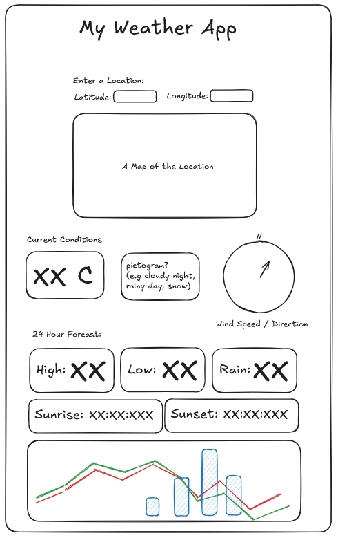

:::::::::::::::::::::::::::::::::::::: questions

- What do we want our application to do?
- What widgets do we want to include in our application?
- What should the layout of our application look like?

::::::::::::::::::::::::::::::::::::::::::::::::

::::::::::::::::::::::::::::::::::::: objectives

- Create a sketch for our application.
- Plan out the information we will need to retrieve from the API.
- Plan out widgets and plots we want to include in our application.

::::::::::::::::::::::::::::::::::::::::::::::::

## Our Application

In the previous section we created a basic Streamlit application, but it was full of placeholder
text and interactions. Let's create something a little more realistic. For this workshop we will be
creating a custom weather application that retrieves data from the Open Meteo API and displays it
in our Streamlit app. The Open Meteo API provides weather data for locations around the world, and
we will be using it to retrieve weather data for a location specified by the user in our app.

## Ideas

Let's take a look at the Open Meteo API documentation to see what kind of data we can retrieve
from the API and think of what information we would find meaningful.

:::::: discussion

Open up the Open Meteo API documentation and take a look at the data we can retrieve. What kinds of
information can we get from the API? What would make for some interesting visualizations or
interactions in our application?

::: solution

Some possible ideas for our application could include:

- A line chart showing the temperature over time.
- A bar chart showing the precipitation levels.
- A compass plot showing the current wind direction and speed.
- Widgets for showing the current weather conditions (temperature)
- Widgets for showing the 24 hour high and low temperatures.
- Widgets for sunrise and sunset times.
- A map showing the location of the user and the current weather conditions at that location.
- An icon showing the current weather conditions (e.g. sunny, cloudy, rainy, etc.)

:::

::::::

For the purposes of this workshop, we've gone ahead and made a sketch of what our application might
look like:

:::::: discussion

What are some other potential user interactions we might consider including to make this even more
interactive?

::: solution

- Instead of a 24 hour forecast, we could use a dropdown to allow the user to select 3, 5, 7 or 10 day forecasts.
- We could add a dropdown to select the type of plot to show (e.g. line chart, bar chart, etc.)
- We could add a dropdown to select hourly or 15 minute data.

:::

::::::

## Planning

Let's take a moment to think about how a user might interact with this application. First off,
most of the information we would want to display in our application is based on the location of the
user, so in the event the user hasn't yet input anything, we don't want to show the remaining
widgets and plots on the page. Instead, we want to show a widget that allows the user to input
their location, and then once they have input their location, we can show the remaining widgets and
plots.

We can use the `st.session_state` to keep track of whether the user has input their location or not,
and then use conditional statements to show or hide the remaining widgets and plots based on the
value of `st.session_state`.

## Start Slow!

Let's not get overwhelmed by the amount of ideas we have! Let's go slow, implementing just one or
two elements at a time. Here's our rough plan to get us started:

1. Create a widget for the user to input their location.
2. Add a plot that shows the user's selected location on a map.
3. Retrieve the weather data for the user's selected location from the Open Meteo API and print the raw JSON data to the page.
4. Get the current temperature for the user's selected location and display it in a widget.
5. Get the 24 hour high and low temperatures for the user's selected location and display them in widgets.
6. Get the sunrise and sunset times for the user's selected location and display them in widgets.

That's not everything we had in mind, but let's start with this and see how it goes! We can
continue to add more elements and interactions as we go along.

::::::::::::::::::::::::::::::::::::: challenge

## Challenge 1:

:::::::::::::::::::::::: solution

:::::::::::::::::::::::::::::::::

::::::::::::::::::::::::::::::::::::::::::::::::

::::::::::::::::::::::::::::::::::::: keypoints

-

::::::::::::::::::::::::::::::::::::::::::::::::
