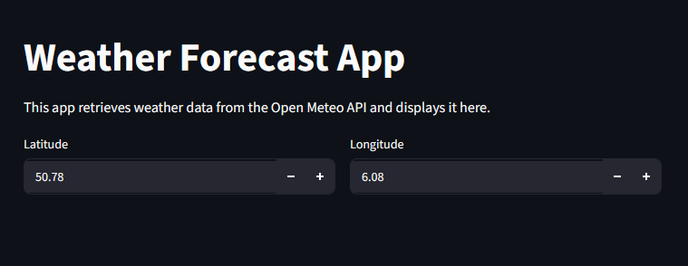
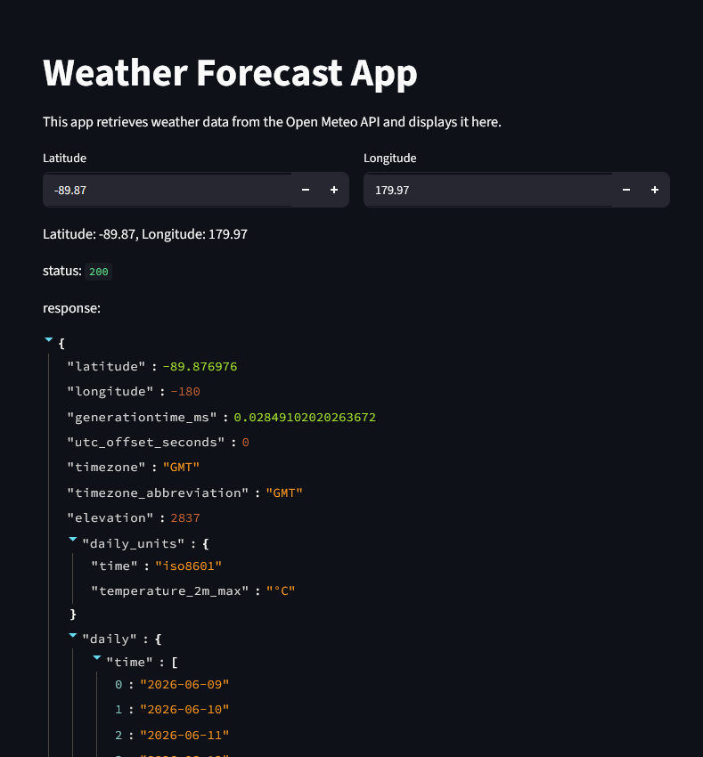

:::::::::::::::::::::::::::::::::::::: questions

-

::::::::::::::::::::::::::::::::::::::::::::::::

::::::::::::::::::::::::::::::::::::: objectives

-

::::::::::::::::::::::::::::::::::::::::::::::::

## Building our Application

Now that we've seen how to make API requests and parse the responses, let's start putting together
a streamlit app that does this for us. We'll start with just a very basic app like we did in
episode 2. Feel free to copy and paste the following code or write your own from scratch into a
new file called `weather_app.py`:

```python
import streamlit as st

st.title("Weather Forecast App")
st.write("This app retrieves weather data from the Open Meteo API and displays it here.")
```

### Adding Widgets to specify API parameters

The base of the API URL will always be the same, so we'll make that a constant at the top of our
script:

```python
import streamlit as st

API_URL = "https://api.open-meteo.com/v1/forecast"

st.title("Weather Forecast App")
st.write("This app retrieves weather data from the Open Meteo API and displays it here.")

```

### Which Widgets?

Let's look at the Streamlit documentation again to see what kind of widgets we might want to use.

You can find the reference documents for input widgets here: https://docs.streamlit.io/develop/api-reference/widgets

We need to get two parameters from the user: latitude and longitude. These are both numbers, so
looking at the "Numeric input elements" section of the documentation, we see two options:
- `st.number_input()`: This widget allows the user to input a number by typing it in or using
  up/down buttons.
- `st.slider()`: This widget allows the user to select a number by dragging a slider.

So clearly, the `st.number_input()` widget is the better choice for our application. Let's look at
the documentation for this widget: https://docs.streamlit.io/develop/api-reference/widgets/st.number_input

The first thing we see is the "Function signature", which shows us exactly how to use the widget in
our code:

```python
st.number_input(label, min_value=None, max_value=None, value="min", step=None, format=None,
key=None, help=None, on_change=None, args=None, kwargs=None, *, placeholder=None, disabled=False,
label_visibility="visible", icon=None, width="stretch", bind=None)
```

This might be a little intimidating at first, but thinking back to our demo example in the previous
episodes, we don't need most of these parameters. In fact, the only required parameter is the
`label`, which is the text that will be displayed next to the input box.

:::::: discussion

What other parameters do you think we might want to use for our application?

::: solution

- `min_value`: This parameter specifies the minimum value that the user can input. For latitude, this
    would be -90, and for longitude, this would be -180.
- `max_value`: This parameter specifies the maximum value that the user can input. For latitude, this
    would be 90, and for longitude, this would be 180.
- `value`: This parameter specifies the default value that will be displayed in the input box when
    the app is first loaded. We can set this to a specific location that we want to show the weather
    for by default.

:::

::::::

Let's add these widgets with our parameters to our code:


```python
lat_lon_columns = st.columns(2)
with lat_lon_columns[0]:
    latitude = st.number_input("Latitude", min_value=-90.0, max_value=90.0, value=50.77664)
with lat_lon_columns[1]:
    longitude = st.number_input("Longitude", min_value=-180.0, max_value=180.0, value=6.08342)
```

Let's run our app just like we did earlier:

```bash
uv run streamlit run weather_app.py
```

The broswer should automatically open a new tab with your app, which should look something like
this:

{alt="Streamlit app with latitude and longitude input widgets"}

Remembering our baby steps approach from before, let's do the most basic thing we can do with this
information now: Add a line to our app that just displays the latitude and longitude that the user
has input:

```python
st.write(f"Latitude: {latitude}, Longitude: {longitude}")
```

### Creating our first Visualization

:::::: discussion

Great! So we know we can get the data from the user. What else can we do with this data. See if you
can find something in the Streamlit documentation that will allow us to display this data in a more
interesting way.

::: solution

Under "Chart elements" in the Streamlit documentation is a widget called `st.map()`, which allows
to display a map with points on it. This would be a great way to show the user's location on a map!
Looking at the function parameters, we can see that it accepts a `data` parameter, which is
"Anything supported by `st.dataframe()` that contains columns named `lat` and `lon`". We can use
our latitude and longitude values to create a data object with the appropriate format and pass it
to this widget to display the user's location on a map.

We will also want to set the "zoom" parameter to a value that allows us to see the location clearly
on the map. We will need to tinker to find a good value for this parameter.

:::

::::::

Let's start by adding this to our app:

```python
... # previous code

location_data = {"lat": [latitude], "lon": [longitude]}
st.map(location_data, zoom=10)
```

Neat! You should see a map with a single point in the center, which is the location specified by
the user. Try changing the latitude and longitude values in the widgets - what happens to the point
on the map?

### Getting data from the API

Next, let's use this data to make a request to the API like we did in the last episode and display
the response in our app. We can use similar code from last time, but here we're going to request
the "current" weather data instead of the forcast data.

```python
import streamlit as st
import requests

... # rest of the code

params = {
    "latitude": latitude,
    "longitude": longitude,
    "current": "temperature_2m_max",
}

response = requests.get(API_URL, params=params)
st.write("status:", response.status_code)
st.write("response:", response.json())
```

You should see something like this in your app:

{alt="Streamlit app with API response"}

Try changing the latitude and longitude values in the widgets - what happens to the data in the
response?

### Getting more data

So far we're only requesting the current temperature, but the API has a lot more data that we can
ask for. Take a look at the API documentation again and see if you can find some other data that
might be interesting to display in our app.

We said before that we would want to know the wind speed and direction, so let's try to get that
data from the API and display it in our app as well.

```python
... # previous code

params = {
    "latitude": latitude,
    "longitude": longitude,
    "current": "temperature_2m_max,wind_speed_10m,wind_direction_10m"
}
```

Perhaps annoyingly, the "current" parameter only accepts a single value, so we can't pass a list.
In order to keep this maintainable, let's create a variable that contains the parameters we want to
request and we'll join them together into a string to pass to the API:

```python
... # previous code

parameters_to_request = ["temperature_2m_max", "wind_speed_10m", "wind_direction_10m"]
params = {
    "latitude": latitude,
    "longitude": longitude,
    "current": ",".join(parameters_to_request)
}
```

## Adding new ways to display our data

Looking back at our sketch, we wanted a section called "Current Conditions" that would show a large
kind of box with the current temperature. Let's look at the Streamlit documentation again and see
if we can find a widget that would allow us to do this.

It looks like the `st.metric()` widget would be perfect for this! This widget allows us to display a
single value with a label, and it also has an optional "delta" parameter that allows us to show the
change in the value compared to a previous value. This would be perfect for showing the current
temperature and give us the option to later add a feature where we see how the temperature has
changed compared to the previous day.

The current temperature is available in the response data we printed out to the app under
"current" -> "temperature_2m_max". We can extract this value and pass it to the `st.metric()`
widget to display it in our app:

```python
... # previous code

st.write("Current Conditions:")
current_data_json = response.json()
current_temperature = current_data_json["current"]["temperature_2m_max"]
st.metric(label="Current Temperature", value=f"{current_temperature} °C")
```

We were kind of hoping for it to be in a box? Let's look at the documentation for `st.metric()`
again and see if there is a way to change it's appearance. It looks like we can add the parameter
`border=True` to get a box around the metric. Let's try that out:

```python
... # previous code
st.metric(label="Current Temperature", value=f"{current_temperature} °C", border=True)
```

Looking back at the parameters, we can also use the "format" parameters to control how the value
is displayed. By default, the value is displayed as a string. For temperature, we want to display
a number with the degree symbol and the unit "C". We can use the format parameter to achieve this:

```python
... # previous code
st.metric(label="Current Temperature", value=current_temperature, format="%.1f °C", border=True)
```

Great! Let's go back and look at the other things we wanted. Well, we wanted to have this section
contain three elements: the current temperature, an icon for the current conditions, and a compass
plot showing the current wind direction and speed. Let's put in placeholders for the other two
elements for now and we'll come back to them later:

```python
... # previous code

col_temperature, col_icon, col_wind = st.columns(3)
with col_temperature:
    st.metric(label="Current Temperature", value=current_temperature, format="%.1f °C", border=True)
with col_icon:
    st.metric(label="Current Conditions", value="?", border=True)
with col_wind:
    st.metric(label="Current Wind", value="?", border=True)
```


::::::::::::::::::::::::::::::::::::: challenge

## Challenge 1a: Retrieve the Weather Code

Go back to the Meteo API and look at the documentation for "Current Weather". We are going to want
to diplay an icon for the current weather conditions. The API provides a "weather code" that is a
number that corresponds to the current weather conditions. Find the parameter that allows us to
retrieve this weather code and add it to our API request. Then, extract the weather code from the
API response and display it in the "Current Conditions" metric.


:::::::::::::::::::::::: solution

```python

parameters_to_request = [
    "temperature_2m_max",
    "wind_speed_10m",
    "wind_direction_10m",
    "weather_code" # Add the weather code to the list of parameters we want to request
]
params = {
    "latitude": latitude,
    "longitude": longitude,
    "current": ",".join(parameters_to_request)
}

response = requests.get(API_URL, params=params)

st.write("Current Conditions:")
current_data_json = response.json()
current_temperature = current_data_json["current"]["temperature_2m_max"]
current_weather_code = current_data_json["current"]["weather_code"] # Extract the weather code from the API response

col_temperature, col_icon, col_wind = st.columns(3)
with col_temperature:
    st.metric(label="Current Temperature", value=current_temperature, format="%.1f °C", border=True)
with col_icon:
    st.metric(label="Current Conditions", value=current_weather_code, border=True)
with col_wind:
    st.metric(label="Current Wind", value="", border=True)
```

:::::::::::::::::::::::::::::::::

::::::::::::::::::::::::::::::::::::::::::::::::


::::::::::::::::::::::::::::::::::::: challenge

## Challenge 1b: Display the Weather Code

Use the following mapping of weather codes to weather conditions to display the current weather
conditions in the "Current Conditions" metric instead of the weather code number:

```python
weather_code_mapping = {
    0: "Clear sky",
    1: "Mainly clear",
    2: "Partly cloudy",
    3: "Overcast",
    45: "Fog",
    48: "Depositing rime fog",
    51: "Drizzle: Light",
    53: "Drizzle: Moderate",
    55: "Drizzle: Dense intensity",
    56: "Freezing Drizzle: Light",
    57: "Freezing Drizzle: Dense intensity",
    61: "Rain: Slight",
    63: "Rain: Moderate",
    65: "Rain: Heavy intensity",
    66: "Freezing Rain: Light",
    67: "Freezing Rain: Heavy intensity",
    71: "Snow fall: Slight",
    73: "Snow fall: Moderate",
    75: "Snow fall: Heavy intensity",
    77: "Snow grains",
    80: "Rain showers: Slight",
    81: "Rain showers: Moderate",
    82: "Rain showers: Violent",
    85: "Snow showers: Slight",
    86: "Snow showers: Heavy",
    95: "Thunderstorm: Slight or moderate",
    96: "Thunderstorm with slight hail",
    99: "Thunderstorm with heavy hail"
}
```

:::::::::::::::::::::::: solution

```python
with col_icon:
    st.metric(label="Current Conditions", value=weather_code_mapping.get(current_weather_code, "Unknown"), border=True)
```

:::::::::::::::::::::::::::::::::

::::::::::::::::::::::::::::::::::::::::::::::::

::::::::::::::::::::::::::::::::::::: challenge

## Challenge 2: The 24 Hour Forecast

Follow the structure we used above to add a new section to our app that shows five elements from
our sketch:

- a row of three metrics: 24 hour high temperature, 24 hour low temperature, total precipitation
- local sunrise and sunset times

::: hint

You'll need to make another API request, but this time instead of asking for the "current" weather
data, you'll want to ask for the "daily" weather data.

:::

::: hint

The "daily" request will return the next 7 days of weather data by default. If we only care about
the next 24 hours, we can limit the result by adding `"forecast_days": 1` to our API request
parameters.

:::

::: hint

Remember to use columns to arrange the metrics in rows:

```python

col1, col2, col3 = st.columns(3)
with col1:
    # code for first metric
with col2:
    # code for second metric
with col3:
    # code for third metric

:::

:::::::::::::::::::::::: solution

```python
parameters_to_request = [
    "temperature_2m_max",
    "temperature_2m_min",
    "precipitation_sum",
    "sunrise",
    "sunset"
]
params = {
    "latitude": latitude,
    "longitude": longitude,
    "daily": ",".join(parameters_to_request),
    "forecast_days": 1
}

response = requests.get(API_URL, params=params)
daily_data_json = response.json()

st.write(daily_data_json) # Print the raw JSON data to the app to see the structure of the data

daily_temperature_max = daily_data_json["daily"]["temperature_2m_max"][0]
daily_temperature_min = daily_data_json["daily"]["temperature_2m_min"][0]
daily_precipitation = daily_data_json["daily"]["precipitation_sum"][0]
daily_sunrise = daily_data_json["daily"]["sunrise"][0]
daily_sunset = daily_data_json["daily"]["sunset"][0]

st.write("24 Hour Forecast:")
col_daily_max, col_daily_min, col_daily_precipitation = st.columns(3)
with col_daily_max:
    st.metric(label="High", value=daily_temperature_max, format="%.1f °C", border=True)
with col_daily_min:
    st.metric(label="Low", value=daily_temperature_min, format="%.1f °C", border=True)
with col_daily_precipitation:
    st.metric(label="Precipitation", value=daily_precipitation, format="%.1f mm", border=True)

col_sunrise, col_sunset = st.columns(2)
with col_sunrise:
    st.metric(label="Sunrise", value=daily_sunrise, border=True)
with col_sunset:
    st.metric(label="Sunset", value=daily_sunset, border=True)
```

:::::::::::::::::::::::::::::::::

::::::::::::::::::::::::::::::::::::::::::::::::


::::::::::::::::::::::::::::::::::::: keypoints

-

::::::::::::::::::::::::::::::::::::::::::::::::
