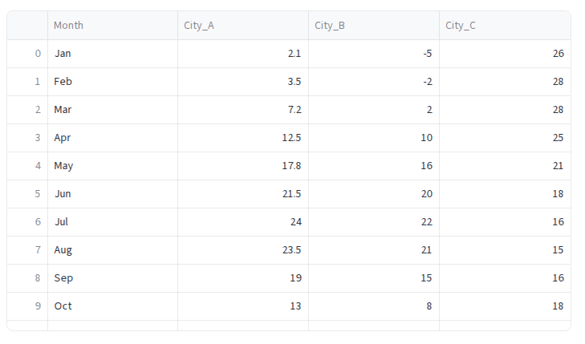
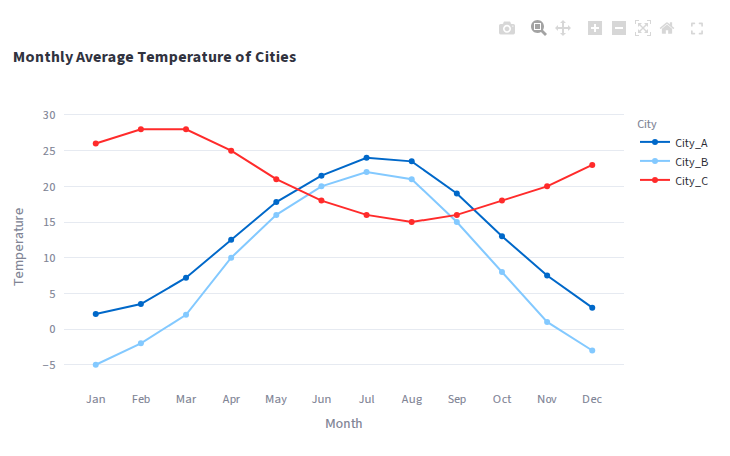
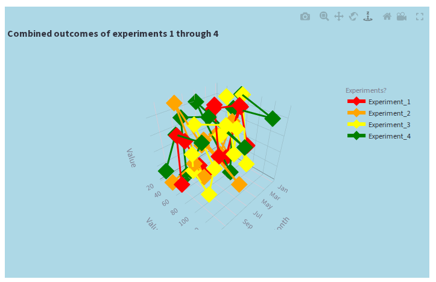
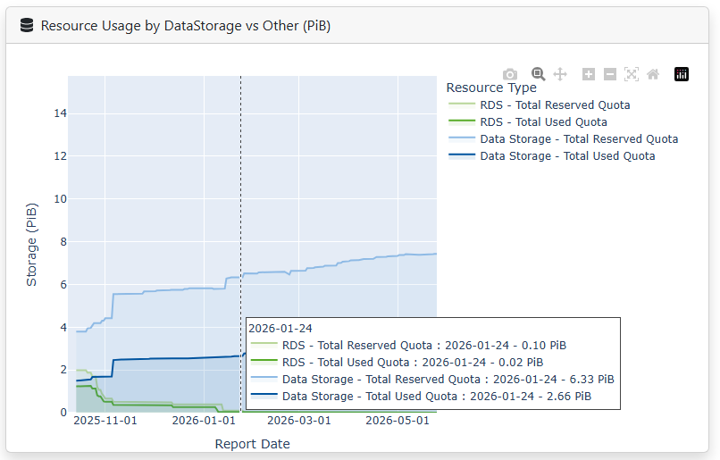
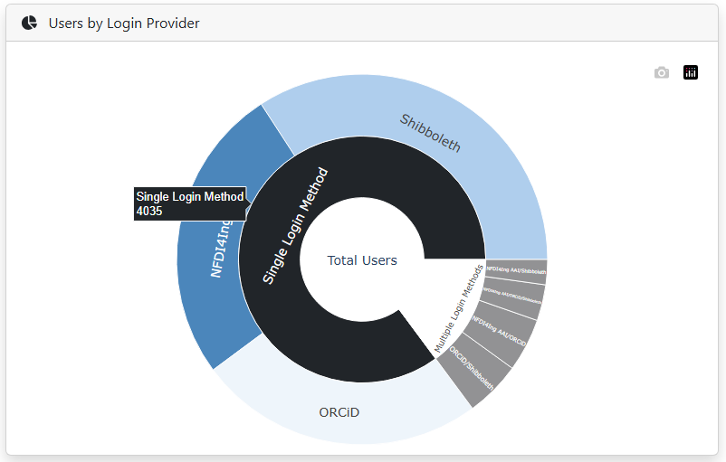
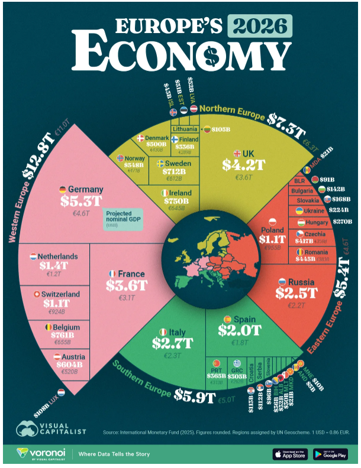
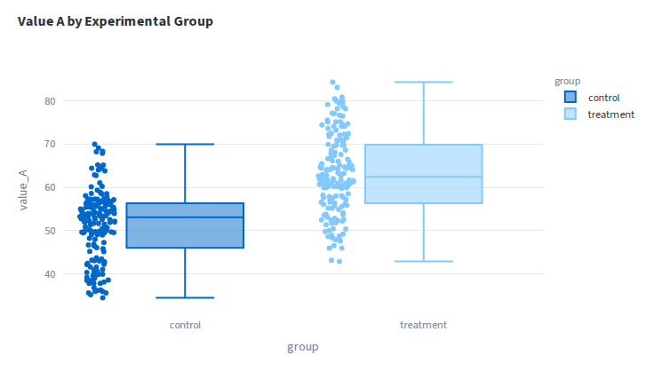
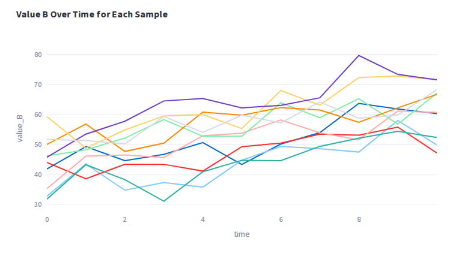
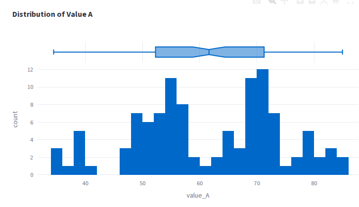
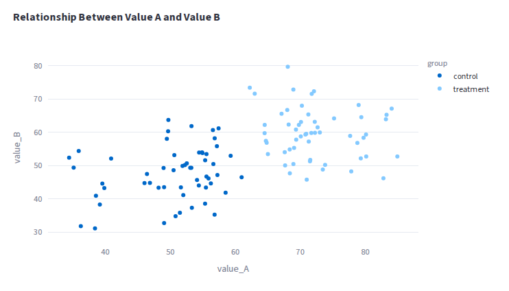

:::::::::::::::::::::::::::::::::::::: questions

-

::::::::::::::::::::::::::::::::::::::::::::::::

::::::::::::::::::::::::::::::::::::: objectives

-

::::::::::::::::::::::::::::::::::::::::::::::::

## Visualization Concepts

Before we dive into the code for making visuals, let's talk about a few concepts

### Why make visuals?

For the most part, humans are visual creatures. We can process information far faster in a visual
format than in text. We are also fantastic pattern recognizsers, and can often spot trends and
insigts in data when it's presented in a visual format that we might miss if we were just looking at
a table of numbers.

This is why one of the earliest things we learn in data science is to take a look at our data and
try a few basic views of it. Take this example. Here's a table of temperatures of three cities over
a year:

{alt="Table of temperatures for three cities over a year"}

Do you see any trends? What can you say about each of the cities based on this table?

Now let's look at the same data in a line plot:

{alt="Line plot of temperatures for three cities over a year"}

Even without knowing anything about the cities, we can see that one of the cities has it's lower
temperatures in the middle of the year, while the other two have their lower temperatures at the
beginning and end of the year - suggesting that the first city is in the southern hemisphere,
while the other two are in the northern hemisphere.

Now you might have been able to spot that trend in the table, but the cognitive load of processing
the numbers and comparing them across rows and columns is much higher than just looking at the
lines in the chart.

### What makes a Visualization Effective?

The effectiveness of a visual depends on a variety of factors, not just "is it attractive". Some
factors are immediate:

- Color choice: Are the colors you chose easy to distinguish? Do they have enough contrast with the
    background? Are they colorblind friendly?
- Size and scale: Is the size of the plot appropriate for the amount of data being displayed? Are the
    axes scaled appropriately to show the trends in the data?
- Labels and titles: Are the axes labeled clearly? Is there a title that explains what the plot is
    showing?
- Elements: Are there too many elements in the plot that make it cluttered and hard to read? Or are
    there too few, leaving large white spaces that make it hard to interpret the data?

Other factors are more subjective and depend on the context of the data and the audience:

- Storytelling: Does the visual tell a story with the data? Does it highlight the most important
    insights and trends in the data?
- Aesthetics: Is the visual appealing to look at? Does it draw the viewer in and make them want to
    explore the data further?

### Example: Charles Joseph Minard's Map of Napoleon's Russian Campaign

The image below is one of the most famous visualizations, created by Charles Joseph Minard in 1869
to show Napolean's disastrous campaign in Russia.

{alt="Charles Joseph Minard's Map of Napoleon's Russian Campaign"}

::: discussion

What makes this visualization effective?

- Width of the lines clearly indicates the size of the army at each point in the campaign
- Geographic information is included to show the path of the campaign
- Temperature is included to show the impact of the cold on the army during the retreat
- Notations are included to provide clear context for the data

:::

### Example: A deliberately bad visualization

Here's a deliberately bad visualization of some random data.

{alt="Deliberately bad visualization"}

::: discussion

What makes this visualization ineffective?

- Clashing color palette
- Inappropriate use of a 3D plot, which distorts the data and makes it hard to read
- Lack of clear labels and titles
- Too many elements in the plot, making it cluttered and hard to read

:::

### Pre-attentive Attributes

Visualizations can rely on "Pre-attentive attributes" in an image to draw the viewer's attention to
certain details before they can even consciously process the information. These attributes include
things like color, size, shape, and position. Take a look at the image below for some examples

{alt="Examples of pre-attentive attributes"}

(Image source [Why Visual Analytics?](https://www.tableau.com/learn/articles/why-visual-analytics))

Going back to our table example above, there's nothing to say that a table is *never* an effective
way of presenting data. Imagine a table of sales figures by store, where the horizontal axis is the
total revenue for each store, and the vertical axis is the name of the store. We could color the
text or fill the background of the cells based on the revenue to quickly draw attention to the
highest and lowest performing stores.

### Color Selection

Color is one of the most powerful pre-attentive attributes, drawing attention to certain elements
in a plot and helping to distinguish between different elements. We can use color as a
pre-attentive atribute - for example, using red/blue to indicate temperatures.

Typically, when making plots, we have a few different types of color schemes to choose from:

- Qualitative: These are color schemes that are designed to distinguish between different
    categories of data. They typically use a variety of colors that are easily distinguishable
    from each other. There is no inherint order to the colors.
- Sequential: These are color schemes that are designed to show a progression of values. They
    typically use a a single color that varies in intensity, with lighter colors representing lower
    values and darker colors representing higher values.
- Diverging: These are color schemes that are designed to show a progression of values that diverge
    from a central point. They typically use two different colors that vary in intensity, with one
    color representing values above the central point and the other color representing values below
    the central point.

## Deciding to Create a Plot

When we have some data that we want to display, we should first decide "What is the question I want
to answer with this plot?". This will help us shape what kind of plot we want to create and what
data to include.

Next, chose a way of conveying the information needed to answer the question. Keep in mind things
like:

- How many categories are we showing?
- How many dimensions of data are we showing?
- Are we comparing values? Or is this a distribution of values? Or are we showing a relationship?

Different types of plots are better for different purposes:

- Scatter plots are good for showing relationships between two variables
- Line plots are good for showing trends over time
- Bar plots are good for comparing values across categories
- Histograms are good for showing the distribution of a single variable
- Box plots are good for showing the distribution of a single variable and comparing it across categories
- Heatmaps are good for showing the relationship between two variables across a grid of values

## Principles of Effective Visualization

Rougier et. al. have a great paper on [Ten Simple Rules for Better Figures](https://journals.plos.org/ploscompbiol/article?id=10.1371/journal.pcbi.1003833)
that goes into more detail on how to make effective visualizations. their ten rules are:

1. Know Your Audience
2. Identify Your Message
3. Adapt the Figure to the Support Medium
4. Captions Are Not Optional
5. Do Not Trust the Defaults
6. Use Color Effectively
7. Do Not Mislead the Reader
8. Avoid "Chartjunk"
9. Message Trumps Beauty
10. Get the Right Tool

::::::::::::::::::::::::::::::::::::: challenge

## Challenge 1: Reviewing a Visualization

Take a look at the following visualizations. What works well? Is there any information that isn't
clearly conveyed? What would you change to make the visualization more effective?

{alt="Visualization 1 for review"}

{alt="Visualization 2 for review"}

{alt="Visualization 3 for review"}

(Source for Visualization 3: [Visual Capitalist](https://www.visualcapitalist.com/ranked-europes-top-economies-in-2026-by-projected-gdp/))

:::::::::::::::::::::::: solution

:::::::::::::::::::::::::::::::::

::::::::::::::::::::::::::::::::::::::::::::::::

::::::::::::::::::::::::::::::::::::: challenge

## Challenge 2: Selecting a Plot Type

You have a dataset with the following columns:
- `sample_id`: A unique identifier for each sample
- `group`: A categorical variable indicating the group that each sample belongs to (e.g. "control" or "treatment")
- `value A`: A numerical variable representing some continuous measurement for each sample
- `value B`: Another numerical variable representing a different continuous measurement for each sample
- `time`: A numerical variable representing the time at which each measurement was taken

For each of the following questions, select the most appropriate plot type to visualize the data:

1. How does `value A` differ between the control and treatment groups?
2. How does `value B` change over time for each sample?
3. What is the distribution of `value A` across all samples?
4. Is there a relationship between `value A` and `value B`?

Explore the [Plotly Documentation](https://plotly.com/python/) for ideas.

:::::::::::::::::::::::: solution

There are no hard and fast rules for which plot type to use, but here are some thoughts:

1. Since we're comparing two groups (control and treatment) for a single numerical variable
   (`value A`), a box plot or a bar plot with error bars would be appropriate to show the
   differences between the groups. Other options could include histograms or density plots, where
   each group is shown in a different color.

{alt="Box plot comparing value A between control and treatment groups"}

1. Time series data is typically visualized with a line plot, where the x-axis represents time and
   the y-axis represents the value of `value B`. We could also try a bar plot if we think there's
   some value to "binning" the time variable into discrete intervals.

{alt="Line plot showing value B over time for each sample"}

2. To show the distribution of `value A` across all samples, a histogram or a density plot would be
    appropriate. A box plot could also be used to show the distribution and identify any outliers.

{alt="Histogram showing the distribution of value A across all samples"}

3. To show the relationship between `value A` and `value B`, a scatter plot would be appropriate,
   where each point represents a sample, the x-axis represents `value A`, and the y-axis represents
   `value B`. We could also add a trend line to the scatter plot to help visualize any correlation
   between the two variables.

{alt="Scatter plot showing the relationship between value A and value B"}

:::::::::::::::::::::::::::::::::

::::::::::::::::::::::::::::::::::::::::::::::::

::::::::::::::::::::::::::::::::::::: keypoints

-

::::::::::::::::::::::::::::::::::::::::::::::::
