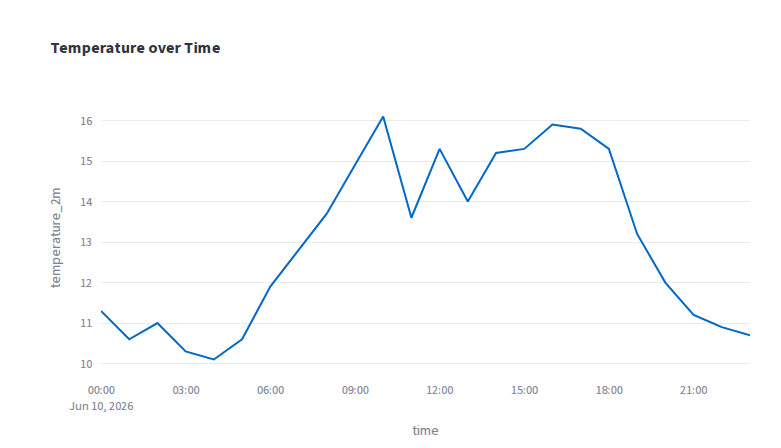
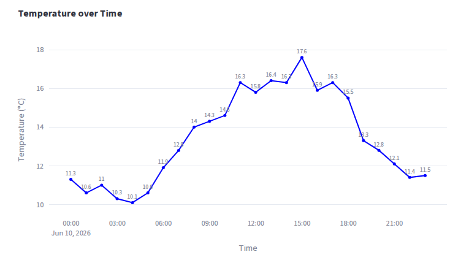
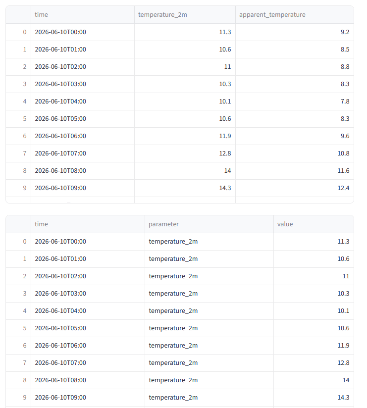
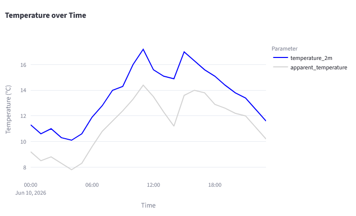
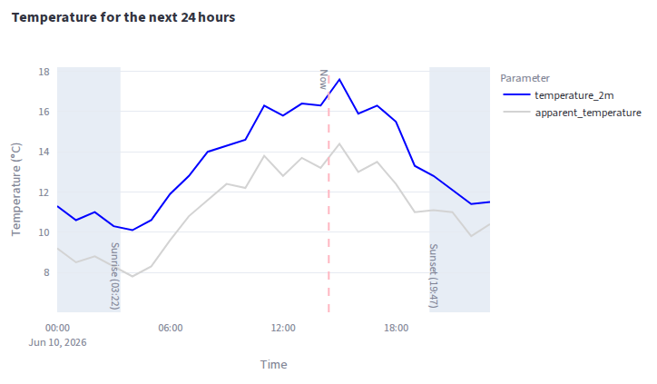

:::::::::::::::::::::::::::::::::::::: questions

- How can we create an interesting, interactive plot in Streamlit using Plotly?
- How can we customize our plot to make it more informative and visually appealing?
- How can we combine different plot types in the same plot to show different aspects of our data?

::::::::::::::::::::::::::::::::::::::::::::::::

::::::::::::::::::::::::::::::::::::: objectives

- Create a line plot using the API data and customize the appearance of the plot
- Convert data from wide to long format to make it easier to plot with Plotly
- Add a secondary y-axis to our plot to show different types of data

::::::::::::::::::::::::::::::::::::::::::::::::

## Making Plots with Plotly

Streamlit has built in support for a variety of plotting libraries, including Plotly, Matplotlib,
and Seaborn. For our application, we will be using Plotly to create interactive plots of our
data. Plotly is based off of D3.js, and allows us to create interactive plots that can be easily
embedded in our Streamlit app.

## First Plot: Temperature over Time

So far we have our metrics, but we don't have any plots yet. And this is supposed to be a workshop
about making visuals after all! Let's start by gathering our data. In the last couple of episodes
we have retrieved the current weather data and the daily weather data, but we can also retrieve
the hourly weather data. On our sketch we had a kind of plot that we imagined, where there were
two lines showing the temperature and apparent temperature over time, and a bar in the background
with the precipitation levels. Let's start with just one line, or "trace" in Plotly terms, showing
the temperature over time.

To begin, we will need to retrieve the hourly weather data from the API. We can do this similarly
to how we retrieved the current weather data and the daily weather data:

```python
parameters_to_request = [
    "temperature_2m",
]
params = {
    "latitude": latitude,
    "longitude": longitude,
    "hourly": ",".join(parameters_to_request),
    "forecast_days": 1,
}

response = requests.get(API_URL, params=params)
hourly_data_json = response.json()

st.write(hourly_data_json)
```

### JSON to DataFrame

A few episodes ago we saw that we could print very nice dataframes to our application. However, the
data that we get back from the API is in JSON format, which python has interpreted as a dictionary.
It looks like we get a key in our response called `hourly`, which contains an entry for each of the
parameters we requested, where each value is a list of values for each hour. Lucky us! This is one
of the formats we can use to easily create a dataframe! Let's replace our `st.write(hourly_data_json)`
with the following code to create a dataframe from our JSON response:

```python
import pandas as pd

... # existing code

hourly_df = pd.DataFrame(hourly_data_json["hourly"])
st.dataframe(hourly_df)
```

### Creating a Plotly Line Chart

Now that we have our data in a dataframe, we can create a line chart using Plotly. We can do this
using the `px.line` function from the Plotly Express module. This function takes in a dataframe and
the names of the columns to use for the x and y axes, and returns a Plotly figure object that we
can display in our Streamlit app:

```python
import plotly.express as px

... # existing code

fig = px.line(hourly_df, x="time", y="temperature_2m", title="Temperature over Time")
st.plotly_chart(fig)
```

{alt="Basic line plot showing temperature over time"}

Eh, it works to show the data, but we want to tidy things up a bit. A couple things we notice right
away:

- The x and y axis labels seem to come right from the dataframe column names
- Hovering over the plot gives us a tooltip, but it's not very readable
- A legend might be nice to have for when we add more traces to the plot later

### Customizing the Plot

We won't go too deep into the Plotly API in this workshop, but let's see how we can quickly
make some changes to our plot. First, we can change the axis labels by passing in a `labels`
dictionary to the `px.line` function:

```python
fig = px.line(
    hourly_df,
    x="time",
    y="temperature_2m",
    title="Temperature over Time",
    labels={
        "time": "Time",
        "temperature_2m": "Temperature (°C)",
    },
)
st.plotly_chart(fig)
```

Next, we can customize the tooltip by passing in a `hover_data` dictionary to the `px.line` function:

```python
fig = px.line(
    hourly_df,
    x="time",
    y="temperature_2m",
    title="Temperature over Time",
    labels={
        "time": "Time",
        "temperature_2m": "Temperature (°C)",
    },
    hover_data={
        "time": "|%H:%M",  # Format the time as hours and minutes
        "temperature_2m": ":.1f",  # Format the temperature to one decimal place
    },
)
st.plotly_chart(fig)
```

And lets' add some text above each point, and decrease the size of the markers:

```python
fig = px.line(
    hourly_df,
    x="time",
    y="temperature_2m",
    text="temperature_2m",
    title="Temperature over Time",
    labels={
        "time": "Time",
        "temperature_2m": "Temperature (°C)",
    },
    hover_data={
        "time": "|%H:%M",  # Format the time as hours and minutes
        "temperature_2m": ":.1f",  # Format the temperature to one decimal place
    },
)
fig.update_traces(textposition="top center", marker={"size": 5}, textfont={"size": 10})
```

I'm fairly happy with this plot:

{alt="Customized line plot showing temperature over time"}

## Adding More Traces and Using Long Format Data

This plot is a little boring though. Our sketch idea way back was to have two lines, one for the
temperature and one for the apparent temperature - let's add the apparent temperature to our plot!
To do this, we will need to request the `apparent_temperature` parameter from the API:

```python
parameters_to_request = ["temperature_2m", "apparent_temperature"]
params = {
    "latitude": latitude,
    "longitude": longitude,
    "hourly": ",".join(parameters_to_request),
    "forecast_days": 1,
}
```

... Huh. So our dataframe updates with the new column, but our plot doesn't update. Why?

We could just add another trace to our plot with another call to `px.line`, but let's be a little
more efficient. Plotly really prefers data that is in the "long" format, where each row is a single
observation and there are columns for the x and y values, and a column that indicates which trace
the observation belongs to.

For a visual example, here is what our data looks like now, and what it would look like in long
format below:

{alt="Example of wide vs long format data"}

This might need some tricky data manipulation to get the way we want it, but luckily pandas has a
built in function called `melt` that can do exactly this! Melt is a method that can be called on
a dataframe and takes three main arguments:

- `id_vars`: A list of columns to keep as is (in our case, this would be the "time" column)
- `var_name`: The name of the new column that will contain the names of the original columns (in
    our case, "parameter")
- `value_name`: The name of the new column that will contain the values from the original columns
    (in our case, "value")

Implementing this in our code looks like this:

```python
hourly_df = pd.DataFrame(hourly_data_json["hourly"])

# Melt the dataframe to convert it from wide to long format
hourly_df_long = hourly_df.melt(id_vars=["time"], var_name="parameter", value_name="value")

st.dataframe(hourly_df_long)
```

And then we can use the new long data in our plot and see that we get two lines, one for each
parameter:

```python
hourly_data_json = response.json()

hourly_df = pd.DataFrame(hourly_data_json["hourly"])

# Melt the dataframe to convert it from wide to long format
hourly_df_long = hourly_df.melt(id_vars=["time"], var_name="parameter", value_name="value")

fig = px.line(
    hourly_df_long, # Use the new long format dataframe
    x="time",
    y="value",  # Change this to "value"
    color="parameter", # Set the color to change by parameter so we get a different line for each
    text="value",
    title="Temperature over Time",
    labels={
        "time": "Time",
        "value": "Temperature (°C)",
        "parameter": "Parameter", # Add a label for the parameter column so we get a nice legend
    },
    hover_data={
        "time": "|%H:%M",  # Format the time as hours and minutes
        "value": ":.1f",  # Format the temperature to one decimal place
    },
)

fig.update_traces(textposition="top center", marker={"size": 5}, textfont={"size": 10})
st.plotly_chart(fig)
```

::: callout

### fig.update_traces

We're using the update traces method here to update the properties of all the traces in the plot
together at the same time. This is a convienient way to make changes without having to set it in
each trace individually. It also gives us access to several properties that we can't set in the
`px.line` function, such as the position of the text labels and the size of the markers.

:::

## Color Selection

Think back to the last episode where we talked about color selection for our plots. This plot
contains two traces, one for the temperature and one for the apparent temperature. In my opinion,
it would be nice to have the temperature trace in a bright color, and the apparent temperature in a
more muted color, since the temperature is the main focus of our plot. Thinking forward, I would
also like to have the precipitation bars in a light blue color, since that's reminiscent of water
and will help to visually distinguish it from the temperature lines. Having everything in different
shades of blue might be a little too much though, so I think I'll go with a light grey for the
apparent temperature.

We can easily change the colors of our traces by passing in a `color_discrete_map` dictionary to
the `px.line` function:

```python
fig = px.line(
    hourly_df_long,
    x="time",
    y="value",
    color="parameter",
    text="value",
    title="Temperature over Time",
    labels={
        "time": "Time",
        "value": "Temperature (°C)",
        "parameter": "Parameter",
    },
    hover_data={
        "time": "|%H:%M",  # Format the time as hours and minutes
        "value": ":.1f",  # Format the temperature to one decimal place
    },
    color_discrete_map={
        "temperature_2m": "blue",
        "apparent_temperature": "lightgrey",
    },
)
fig.update_traces(textposition="top center", marker={"size": 5}, textfont={"size": 10})
st.plotly_chart(fig)

At this point, the text labels are looking a little messy. Remember to "avoid chartjunk"! I think
the plot is pretty clear without the text labels, so let's remove those:

```python
fig = px.line(
    hourly_df_long,
    x="time",
    y="value",
    color="parameter",
    # text="value",
    title="Temperature over Time",
    labels={
        "time": "Time",
        "value": "Temperature (°C)",
        "parameter": "Parameter",
    },
    hover_data={
        "time": "|%H:%M",  # Format the time as hours and minutes
        "value": ":.1f",  # Format the temperature to one decimal place
    },
    color_discrete_map={
        "temperature_2m": "blue",
        "apparent_temperature": "lightgrey",
    },
)
fig.update_traces(textposition="top center", marker={"size": 5}, textfont={"size": 10})
st.plotly_chart(fig)
```

::: callout

### Color Maps

Plotly comes with a number of built in color maps that we can use to quickly set the colors of our
traces. You can find a list of the built in color maps in the Plotly documentation here:
https://plotly.com/python/discrete-color/#color-sequences-in-plotly-express

:::

Here's what our plot looks like now:

{alt="Customized line plot showing temperature and apparent temperature over time"}

## What is the question we are answering?

We should always keep in mind the question we are trying to answer. In this case, it is something
like "What does the temperature and apparent temperature look like over the course of the day?".
But our data shows the temperatures for the current day, midnight to midnight. There's an additional
aspect of this plot that is useful, which is "what time is it currently?" Let's add a vertical line
to our plot to show the current time:

```python
from datetime import datetime

... # existing code

current_time = datetime.now().strftime("%Y-%m-%dT%H:%M")
fig.add_vline(x=current_time, line_dash="dash", line_color="lightpink")
```

Without context, this is just a red dashed line, so let's add an annotation to explain what it is:

```python
from datetime import datetime

... # existing code

current_time = datetime.now().strftime("%Y-%m-%dT%H:%M")
fig.add_vline(x=current_time, line_dash="dash", line_color="lightpink")
fig.add_annotation(
    x=current_time,
    y=hourly_df_long["value"].max(),  # Position the annotation at the top of the plot
    text="Now",
    showarrow=False,  # Don't show an arrow pointing to the line
    textangle=90,  # Rotate the text to be vertical
    xshift=-5,  # Shift the text slightly to the left of the line
)

```

Another relevant element - when is sunrise and sunset? We can add shaded areas to the plot to
indicate when it is day and when it is night:

```python
# Add a shaded regions to indicate nighttime hours
sunrise_time = datetime.strptime(daily_sunrise, "%Y-%m-%dT%H:%M")
fig.add_vrect(
    x0=hourly_df["time"].min(),
    x1=sunrise_time,
    fillcolor="lightsteelblue",
    opacity=0.3,
    layer="below",
    line_width=0,
)
fig.add_annotation(
    x=sunrise_time,
    y=hourly_df_long["value"].min(),  # Position the annotation at the bottom of the plot
    text=f"Sunrise ({sunrise_time.strftime('%H:%M')})",
    showarrow=False,  # Don't show an arrow pointing to the line
    textangle=90,  # Rotate the text to be vertical
    xshift=-5,  # Shift the text slightly to the left of the line
)

# Identical to above, but for sunset time and shifting the annotation to the right of the line instead of the left

sunset_time = datetime.strptime(daily_sunset, "%Y-%m-%dT%H:%M")
fig.add_vrect(
    x0=sunset_time,
    x1=hourly_df["time"].max(),
    fillcolor="lightsteelblue",
    opacity=0.3,
    layer="below",
    line_width=0,
)
fig.add_annotation(
    x=sunset_time,
    y=hourly_df_long["value"].min(),  # Position the annotation at the bottom of the plot
    text=f"Sunset ({sunset_time.strftime('%H:%M')})",
    showarrow=False,  # Don't show an arrow pointing to the line
    textangle=90,  # Rotate the text to be vertical
    xshift=5,  # Shift the text slightly to the right of the line
)
```

Ok! I think that's looking pretty good so far:

{alt="Line plot with current time and sunrise/sunset annotations"}

Adding in the sunrise and sunset times gives additional context to our plot and removes the need for
the two metric boxes we have above the plot that show the sunrise and sunset times, since that
information is now included in our visual.

## Mixing plot types

We also had the idea to add bars for precipitation levels in the background of our plot. Let's start
by adding "precipitation" to our list of parameters to request from the API:

```python
parameters_to_request = ["temperature_2m", "apparent_temperature", "precipitation"]
```

Immediately we see that our plot has updated with a new line for precipitation, but that's not what
we really wanted. First, let's exclude the non-temperature parameters from our line plot:

```python
# Limit the temperature data to the two parameters we are interested in
temperature_data = hourly_df_long[
    hourly_df_long["parameter"].isin(["temperature_2m", "apparent_temperature"])
]

fig = px.line(
    temperature_data,
    x="time",
    y="value",
    color="parameter",
    ... # existing code
```

... and then select our precipitation data and create a seperate dataframe for it:

```python
precipitation_data = hourly_df_long[hourly_df_long["parameter"] == "precipitation"]
```

::: callout

plotly.express vs plotly.graph_objects

Plotly has two main interfaces for creating plots: the "express" interface, which is a high level
interface that allows you to create plots with a single function call, and the "graph_objects"
interface, which is a lower level interface that gives you more control over the details of your
plot. In this example, we are using the express interface to create our line plot, and then using
the graph_objects interface to add a bar trace for our precipitation data and to customize the
layout of our plot.

:::


Next we want to create a new trace for our precipitation data, but we want it to be a bar trace
instead of a line trace:

```python
import plotly.graph_objects as go # Add this import at the top of the file

... # existing code

fig.add_trace(
    go.Bar(
        x=precipitation_data["time"],
        y=precipitation_data["value"],
        name="Precipitation",
        yaxis="y2",  # Assign to secondary y-axis
        marker_color="lightblue",
        hovertemplate="Time: %{x}<br>Precipitation: %{y:.1f} mm<extra></extra>",
    )
)
```

And then we need to add a secondary y-axis to our plot for the precipitation data:

```python
fig.update_layout(
    yaxis={"title": "Temperature (°C) / Precipitation (mm)", "side": "left"},
    yaxis2={
        "title": "Precipitation (mm)",
        "overlaying": "y",
        "side": "right",
        "showgrid": False,
        "range": [
            0,
            max(5, precipitation_data["value"].max() * 1.2),
        ],  # Minimum max of 5mm or 20% above actual max
    },
    legend_title_text="Parameter",
)
```
## Deep Breath

Phew! That's a lot of code. Here's the full code for our plot so far, complete with additional
comments to explain each step:

```python
# --- 1. Fetch hourly data from the API ---
# Request all three parameters we need in one API call
parameters_to_request = ["temperature_2m", "apparent_temperature", "precipitation"]
params = {
    "latitude": latitude,
    "longitude": longitude,
    "hourly": ",".join(parameters_to_request),  # Join the list into a comma-separated string for the API
    "forecast_days": 1,
}

response = requests.get(API_URL, params=params)
hourly_data_json = response.json()

# --- 2. Shape the data ---
# The API returns a dict like {"time": [...], "temperature_2m": [...], ...}
# pd.DataFrame can turn that directly into a wide-format dataframe
hourly_df = pd.DataFrame(hourly_data_json["hourly"])

# Melt from wide to long format so Plotly can use a single "parameter" column
# to assign one line color per variable (time stays as the shared x-axis column)
hourly_df_long = hourly_df.melt(id_vars=["time"], var_name="parameter", value_name="value")

# Keep only the two temperature parameters for the line traces;
# precipitation will be handled separately as a bar trace
temperature_data = hourly_df_long[
    hourly_df_long["parameter"].isin(["temperature_2m", "apparent_temperature"])
]

# Replace the raw API parameter names with human-readable labels
# (these must match the keys used in color_discrete_map below)
temperature_data["parameter"] = temperature_data["parameter"].replace(
    {"temperature_2m": "Temperature (°C)", "apparent_temperature": "Apparent Temperature (°C)"}
)

# --- 3. Build the base line plot (Plotly Express) ---
fig = px.line(
    temperature_data,
    x="time",
    y="value",
    color="parameter",       # One line per unique value in the "parameter" column
    # text="value",          # Uncomment to show value labels on each point
    title="Temperature and Precipitation for the next 24 hours",
    labels={
        "time": "Time",
        "value": "Temperature (°C)",
        "parameter": "Parameter",
    },
    hover_data={
        "time": "|%H:%M",    # Format the time as hours and minutes in the tooltip
        "value": ":.1f",     # Format the temperature to one decimal place
    },
    color_discrete_map={
        "Temperature (°C)": "blue",          # Primary focus — bright color
        "Apparent Temperature (°C)": "lightgrey",  # Secondary — muted so it doesn't compete
    },
)

# --- 4. Add precipitation as a bar trace (Plotly Graph Objects) ---
# Isolate the precipitation rows from the long-format dataframe
precipitation_data = hourly_df_long[hourly_df_long["parameter"] == "precipitation"]

# go.Bar lets us assign this trace to a second y-axis ("y2"),
# which is not possible through the px.line interface alone
fig.add_trace(
    go.Bar(
        x=precipitation_data["time"],
        y=precipitation_data["value"],
        name="Precipitation",
        yaxis="y2",           # Tell Plotly to use the secondary y-axis for this trace
        marker_color="lightblue",
        hovertemplate="Time: %{x}<br>Precipitation: %{y:.1f} mm<extra></extra>",
    )
)

# --- 5. Mark the current time ---
# Format must match the time strings in the dataframe so Plotly places it correctly on the x-axis
current_time = datetime.now().strftime("%Y-%m-%dT%H:%M")
fig.add_vline(x=current_time, line_dash="dash", line_color="lightpink")
fig.add_annotation(
    x=current_time,
    y=temperature_data["value"].max(),  # Anchor the label at the top of the plot
    text="Now",
    showarrow=False,   # No arrow — the vertical line itself is the pointer
    textangle=90,      # Rotate text to run vertically alongside the line
    xshift=-5,         # Nudge left so the label doesn't overlap the line
)

# --- 6. Shade nighttime hours before sunrise and after sunset ---
# Parse the sunrise/sunset strings (from the daily API response) into datetime objects
sunrise_time = datetime.strptime(daily_sunrise, "%Y-%m-%dT%H:%M")
fig.add_vrect(
    x0=hourly_df["time"].min(),  # Start of the day (midnight)
    x1=sunrise_time,             # End of the pre-sunrise region
    fillcolor="lightsteelblue",
    opacity=0.3,
    layer="below",   # Draw behind the traces so the lines remain visible
    line_width=0,    # No border on the shaded region
)
fig.add_annotation(
    x=sunrise_time,
    y=hourly_df_long["value"].min(),  # Anchor label at the bottom of the plot
    text=f"Sunrise ({sunrise_time.strftime('%H:%M')})",
    showarrow=False,
    textangle=90,
    xshift=-5,  # Place label just to the left of the sunrise boundary
)

sunset_time = datetime.strptime(daily_sunset, "%Y-%m-%dT%H:%M")
fig.add_vrect(
    x0=sunset_time,              # Start of the post-sunset region
    x1=hourly_df["time"].max(),  # End of the day (midnight)
    fillcolor="lightsteelblue",
    opacity=0.3,
    layer="below",
    line_width=0,
)
fig.add_annotation(
    x=sunset_time,
    y=hourly_df_long["value"].min(),
    text=f"Sunset ({sunset_time.strftime('%H:%M')})",
    showarrow=False,
    textangle=90,
    xshift=5,  # Place label just to the right of the sunset boundary
)

# --- 7. Configure both y-axes ---
# Because we used go.Bar with yaxis="y2", we need to explicitly define that axis here.
# "overlaying": "y" means y2 shares the same plot area as the primary y-axis.
fig.update_layout(
    yaxis={
        "title": "Temperature (°C)",
        "side": "left",
    },
    yaxis2={
        "title": "Precipitation (mm)",
        "overlaying": "y",   # Share the same x-axis / plot area as the primary y-axis
        "side": "right",
        "showgrid": False,   # Hide y2 gridlines to avoid visual clutter
        "range": [
            0,
            max(5, precipitation_data["value"].max() * 1.2),  # Minimum max of 5mm or 20% above actual max
        ],
    },
    legend_title_text="Parameter",
)

st.plotly_chart(fig)
```

Let's take a moment to recap

::::::::::::::::::::::::::::::::::::: challenge

## Challenge 1: Adjust the range of the primary y-axis

In the `fig.update_layout` function, we set the range of the secondary y-axis to be either
5mm or 20% above the actual maximum precipitation value, whichever is greater. This is to ensure
that the precipitation bars are visible even when the maximum precipitation value is very low.

Try to do the same thing for the primary y-axis, which is currently set to adjust automatically
based on the data.


:::::::::::::::::::::::: solution

```python
fig.update_layout(
    yaxis={
        "title": "Temperature (°C)",
        "side": "left",
        "range": [
            min(
                temperature_data["value"].min() * 1.2, -10
            ),  # Minimum of 20% below actual min or -10°C
            max(
                temperature_data["value"].max() * 1.2, 30
            ),  # Maximum of 20% above actual max or 30°C
        ],
    },
    yaxis2={
        "title": "Precipitation (mm)",
        "overlaying": "y",
        "side": "right",
        "showgrid": False,
        "range": [
            0,
            max(5, precipitation_data["value"].max() * 1.2),
        ],  # Minimum max of 5mm or 20% above actual max
    },
    legend_title_text="Parameter",
)
```

:::::::::::::::::::::::::::::::::

::::::::::::::::::::::::::::::::::::::::::::::::

::::::::::::::::::::::::::::::::::::: challenge

## Challenge 2: Input Element to Select "Forcast Days"

In the parameters for our API call, we have a parameter called `forecast_days` that allows us to
specify how many days of forecast data we want to retrieve. Currently, we have this set to 1, which
means we are only getting data for the current day. Try adding a Streamlit input element that
allows the user to select how many days of forecast data they want to see, and then update the
API call and the plot accordingly.

Check the API documentation! There are limitations to this value!

Note that you will need to comment out the code that adds the shaded regions for sunrise and sunset,
or add either some conditional logic to only add those shaded regions when `forecast_days` is 1, or
add shaded regions for the sunrise and sunset times for each day that is included in the forecast.

::: hint

Use a `st.number_input` or a `st.selectbox` to allow the user to select a number of days. Be sure
that the user can't select a number greater than 16 or less than 1.

:::

:::::::::::::::::::::::: solution

You can add either a `st.number_input` or a `st.selectbox` to allow the user to select the number
of forecast days. Here's how you can do it with a `st.number_input`:

```python
forecast_days = st.number_input("Forecast Days", min_value=1, max_value=16, value=1)
```

or with a `st.selectbox`:

```python
forecast_days = st.selectbox("Forecast Days", options=[1, 2, 3, 4, 5, 6, 7], index=0)
```

Then, you can use the `forecast_days` variable in your API call parameters:

```python
params = {
    "latitude": latitude,
    "longitude": longitude,
    "hourly": ",".join(parameters_to_request),
    "forecast_days": forecast_days,  # Use the user-selected value here
}
```

:::::::::::::::::::::::::::::::::

::::::::::::::::::::::::::::::::::::::::::::::::


::::::::::::::::::::::::::::::::::::: keypoints

- Long format data is more readily interpreted by Plotly
- There are a multitude of formatting and style options we can add to a plot to get it to look how we want.

::::::::::::::::::::::::::::::::::::::::::::::::
