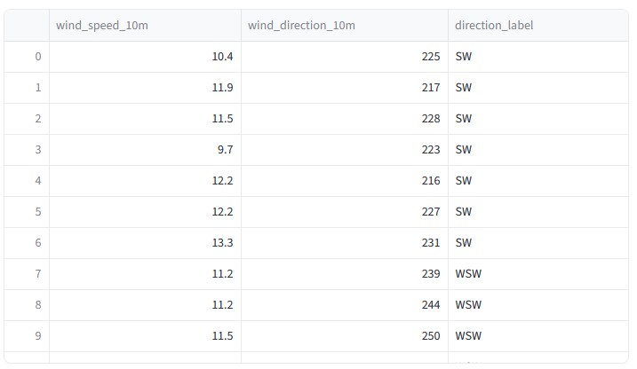
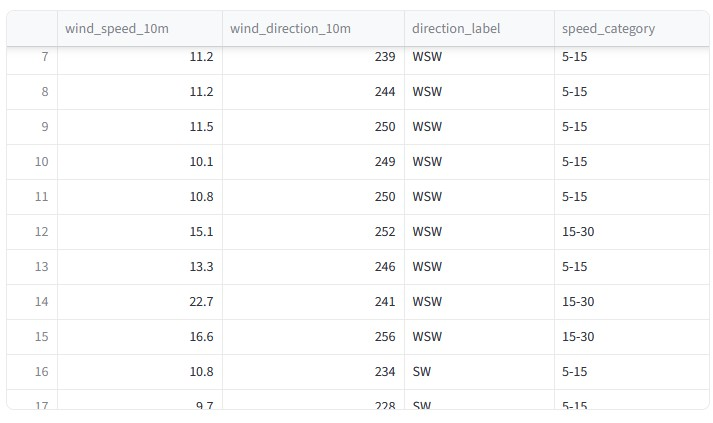
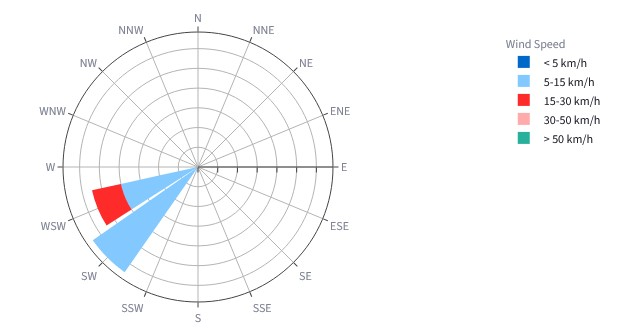
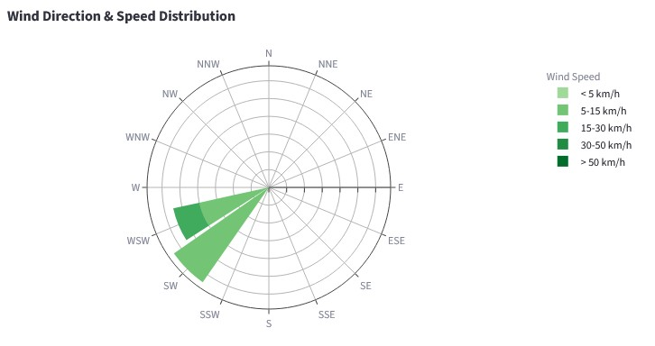

:::::::::::::::::::::::::::::::::::::: questions

-

::::::::::::::::::::::::::::::::::::::::::::::::

::::::::::::::::::::::::::::::::::::: objectives

-

::::::::::::::::::::::::::::::::::::::::::::::::

## Making a Wind Rose Plot

We've talked about different kinds of plots so far, but usually in the context of a rectangular
image. We're not just limited to that, though! In this episode, we'll look at how to create a
wind rose plot using a `Barpolar` plot in Plotly.

### What is a Wind Rose Plot?

A wind rose plot is a circular plot that shows the distribution of wind directions and speeds at a
particular location. It is often used in meteorology to visualize the prevailing wind patterns over
a specific period of time, and typically consists of bars that extend outward from the center, with
the length of each bar representing the frequency or intensity of winds coming from a particular
direction.

In the case of our data, we have hourly wind data which includes both wind speed and direction.

## Preparing the Data

We've already fetched the hourly wind data, but just in case, go back up to where we define the
`parameters_to_request` for our hourly data and make sure to include the following parameters:

```python
parameters_to_request = [
    "temperature_2m",
    "apparent_temperature",
    "precipitation",
    "wind_speed_10m",
    "wind_direction_10m",
]
```

For the plot we're working on, we only need the last two parameters, so we'll pull those out and
copy them into their own dataframe:

```python
wind_df = hourly_df[["wind_speed_10m", "wind_direction_10m"]].copy()
```


## Binning

We may have gotten into binning when we talked about Histograms, but just to refresh your memory:
Binning is the process of grouping continuous data into discrete intervals, or "bins". This is
often done to simplify the data and make it easier to analyze or visualize. For example, if we have
a dataset of ages, we might bin the ages into groups like 0-9, 10-19, 20-29, etc. This can help us
see patterns or trends in the data that might not be as apparent when looking at the raw data.

In the case of our own wind data, we have the wind direction as a continuous variable (0-360
degrees), but for our wind rose plot, we want to group these into discrete bins for the cardinal
and inter-cardinal directions (N, NE, E, SE, S, SW, W, NW).

We'll define our bins and labels like this:

```python
compass_labels = [
    "N",
    "NNE",
    "NE",
    "ENE",
    "E",
    "ESE",
    "SE",
    "SSE",
    "S",
    "SSW",
    "SW",
    "WSW",
    "W",
    "WNW",
    "NW",
    "NNW",
]
```

We'll add a new column to our dataframe called "direction_label" and assign the appropriate label
to each row based on the bin index. A little bit of math is involved here to calculate the bin
index from the wind direction:

```python
bin_indices = ((wind_df["wind_direction_10m"] + 11.25) % 360 / 22.5).astype(int)
wind_df["direction_label"] = [compass_labels[i] for i in bin_indices]
```

And add a `st.dataframe(wind_df)` to check that everything looks correct:

{alt="Wind Dataframe with Direction Labels"}


Next, we want to do the same thing for the wind speed. This time, we'll use a pandas functon called
`pd.cut()` which is a convenient way to bin continuous data into discrete intervals. In order for
this to work, we need to define the edges of the bins and the labels for each bin:

```python
speed_bins = [0, 5, 15, 30, 50, float("inf")]
speed_labels = ["< 5", "5-15", "15-30", "30-50", "> 50"]  # all in km/h
wind_df["speed_category"] = pd.cut(wind_df["wind_speed_10m"], bins=speed_bins, labels=speed_labels)
```

Again, we can check that everything looks correct by displaying the dataframe:

{alt="Wind Dataframe with Speed Categories"}

## Building the Plot

Now that we have our data prepared, we can start building our plot. We'll use a `Barpolar` plot in
Plotly to create our wind rose plot. The `Barpolar` plot is a type of polar plot that allows us to
create bars that extend outward from the center, which is perfect for our wind rose plot.

We'll use Plotly Grapch Objects for the entire plot. Each trace will be a different speed category:

```python
wind_fig = go.Figure()

for speed_label in speed_labels:
    # Count how many hours fall into this speed band for each compass sector
    counts = (
        wind_df[wind_df["speed_category"] == speed_label]
        .groupby("direction_label", observed=True)
        .size()
        .reindex(compass_labels, fill_value=0)  # keep all 16 sectors even if count is zero
    )
    wind_fig.add_trace(
        go.Barpolar(
            r=counts.values,
            theta=compass_labels,
            name=f"{speed_label} km/h",
        )
    )
```

That gives us a plot that looks like this:

{alt="Wind Rose Plot with Standard Colors"}

## Customizing the Plot

The default colors for the bars aren't very intuitive, so let's customize them to make it easier to
interpret the plot. We already have blues in our temperature plot, so use greens for wind speeds.
Plotly has a built-in color scale called "Greens" that we can use for this purpose.

```python
wind_fig = go.Figure()

# Define a color for each speed category using the "Greens" color scale
colors = color_discrete_sequence = px.colors.sequential.Greens[3 : len(speed_labels) + 3]

for speed_label, color in zip(speed_labels, colors):
    # Count how many hours fall into this speed band for each compass sector
    counts = (
        wind_df[wind_df["speed_category"] == speed_label]
        .groupby("direction_label", observed=True)
        .size()
        .reindex(compass_labels, fill_value=0)  # keep all 16 sectors even if count is zero
    )
    wind_fig.add_trace(
        go.Barpolar(
            r=counts.values,
            theta=compass_labels,
            name=f"{speed_label} km/h",
            marker_color=color, # set the color for this trace
        )
    )

```

And then for the overall layout, let's set some properties to make it look nicer:

```python
wind_fig.update_layout(
    title="Wind Direction & Speed Distribution",
    polar={
        "angularaxis": {
            "direction": "clockwise",  # compass convention: angles increase clockwise
            "rotation": 90,  # place North at the top of the chart
        },
        "radialaxis": {"showticklabels": False},  # hide radial numbers for a cleaner look
    },
    legend_title_text="Wind Speed",
)
```

This gives us a much more intuitive plot:

{alt="Wind Rose Plot with Custom Colors"}

::::::::::::::::::::::::::::::::::::: challenge

## Challenge 1:


:::::::::::::::::::::::: solution


:::::::::::::::::::::::::::::::::

::::::::::::::::::::::::::::::::::::::::::::::::


::::::::::::::::::::::::::::::::::::: keypoints

-

::::::::::::::::::::::::::::::::::::::::::::::::
